# Baseline 결과 기록: baseline

- 검색 방식: `baseline` — 순수 벡터 RAG (청크 임베딩 유사도 Top-K, 오류코드 우선 규칙 없음)
- 실행 시각: 2026-10-02 12:03
- 설정: 청크 500자 / 겹침 100자 · Top-K 8 · 임베딩 text-embedding-3-small · 답변 모델 gpt-4o-mini
- 질문 수: 10

## 요약

| 정답 문서 포함 | MRR | 문서 근거 있는 답변 |
|---|---|---|
| 7/8 | 0.81 | 9/10 |

- 정답 문서 포함: 정답 페이지를 Top-K 안에서 찾은 질문 수. 복합 질문은 하위 주제를 모두 찾아야 포함. 문서에 없는 질문은 제외.
- MRR: 첫 정답 문서 순위의 역수 평균(1에 가까울수록 정답이 앞에 옴).
- 문서 근거 있는 답변: 인용이 있고 모두 정답 문서 안이면 O. 문서에 없는 질문은 '근거 없음'을 밝히고 수치를 지어내지 않으면 O. 답변이 질문의 모든 부분에 답했는지는 보지 않으므로 문제점 열의 [검토] 항목과 함께 봅니다.
- 답변 수동 검토: 제대로 4 · 부분 5 · 실패 1 (질문 10개)

## 질문별 기록

| 질문 | 검색 Top-K 문서 | 정답 문서 포함 여부 | 최종 답변 | 문서 근거 여부 | 문제점 |
|---|---|---|---|---|---|
| **Q01** 정답이 명확한 질문 급수구 거름망은 어떻게 청소하나요? | 1. 40쪽 `p40-c1` (0.560) 2. 41쪽 `p41-c1` (0.459) 3. 58쪽 `p58-c3` (0.426) 4. 57쪽 `p57-c2` (0.419) 5. 39쪽 `p39-c1` (0.419) 6. 6쪽 `p6-c1` (0.411) 7. 9쪽 `p9-c1` (0.410) 8. 5쪽 `p5-c3` (0.405) | O (첫 정답 1위) 정답: 40쪽 | 판단: 자가 점검 우선 이유: 급수구 거름망 청소 방법을 안내해 드리겠습니다. 1. 수도꼭지를 잠근 후 제품 뒤쪽에 연결된 급수 호스를 분리하세요. 2. 거름망을 손 또는 집게로 잡아 빼낸 후 칫솔 같은 도구를 사용하여 오물을 제거하세요. 이 과정을 통해 급수구 거름망을 청소하실 수 있습니다. 자세한 내용은 [PDF 40쪽]을 참고하세요. **검토: O** | O 인용 [40] 모두 정답 문서 안 [근거 캡처 보기](#evidence-q01) | 없음 |
| **Q02** 정답이 명확한 질문 통살균 코스는 얼마나 자주 해야 하나요? | 1. 41쪽 `p41-c3` (0.546) 2. 41쪽 `p41-c2` (0.539) 3. 42쪽 `p42-c1` (0.456) 4. 41쪽 `p41-c1` (0.395) 5. 56쪽 `p56-c3` (0.361) 6. 57쪽 `p57-c2` (0.354) 7. 22쪽 `p22-c1` (0.328) 8. 41쪽 `p41-c4` (0.323) | O (첫 정답 1위) 정답: 41쪽/42쪽/56쪽 | 판단: 추가 확인 필요 이유: 상담에 필요한 증상 정보가 아직 없습니다. 안녕하세요. 워시타워 세탁기 사용설명서를 근거로 자가 점검을 안내해 드립니다. 어떤 증상인지 알려주시겠어요? 표시부에 오류코드(예: OE, IE)가 보인다면 함께 알려주시면 더 정확히 안내해 드릴 수 있습니다. **검토: X** | X 답변 미생성(검색 없이 종료) [근거 캡처 보기](#evidence-q02) | 검색은 됐으나 상담 흐름에서 답변 없이 종료(판단: 추가 확인 필요) → 상담 흐름(범위 분류) 수정 — 검색 전략 대상 아님 [검토] 사용법 질문(통살균 코스 주기)을 증상이 없다는 이유로 차단함. 코스 사용 방법을 물은 것이므로 패싱하지 말고 '워시타워 세탁기 기준'임을 밝힌 뒤 설명서(41·42쪽) 내용으로 바로 설명했어야 함 → 범위 분류에서 사용법 질문 통과 + 시스템 프롬프트 규칙 추가 필요 |
| **Q03** 표현이 다른 질문 빨래를 다 하고 꺼냈는데 옷에서 쉰내가 나요. | 1. 17쪽 `p17-c2` (0.403) 2. 17쪽 `p17-c3` (0.368) 3. 58쪽 `p58-c4` (0.344) 4. 19쪽 `p19-c1` (0.343) 5. 18쪽 `p18-c3` (0.342) 6. 17쪽 `p17-c1` (0.341) 7. 24쪽 `p24-c3` (0.340) 8. 21쪽 `p21-c4` (0.335) | O (첫 정답 3위) 정답: 58쪽/41쪽 | 판단: 자가 점검 우선 이유: 세탁 후 세탁물을 장시간 방치하면 냄새가 날 수 있습니다. 세탁이 끝난 후에는 세탁물을 바로 꺼내는 것이 좋습니다. 또한, 세탁통 내부의 습기가 제대로 제거되지 않으면 냄새가 생길 수 있으니, 세탁이 끝난 후에는 문을 열어 두어 내부의 습기가 완전히 마를 수 있도록 해주세요. 이와 관련된 내용은 [PDF 58쪽]에서 확인하실 수 있습니다. **검토: O** | O 인용 [58] 모두 정답 문서 안 [근거 캡처 보기](#evidence-q03) | 없음 |
| **Q04** 표현이 다른 질문 탈수할 때 세탁기가 덜덜거리면서 자리에서 조금씩 움직여요. | 1. 59쪽 `p59-c1` (0.529) 2. 59쪽 `p59-c2` (0.527) 3. 24쪽 `p24-c1` (0.516) 4. 21쪽 `p21-c2` (0.503) 5. 58쪽 `p58-c4` (0.489) 6. 17쪽 `p17-c2` (0.489) 7. 23쪽 `p23-c2` (0.483) 8. 6쪽 `p6-c3` (0.480) | O (첫 정답 1위) 정답: 58쪽/59쪽/55쪽 | 판단: 자가 점검 우선 이유: 탈수 시 세탁물이 한쪽으로 치우쳐져 소음과 진동이 발생할 수 있습니다. 세탁물을 고르게 펴서 한 번 더 탈수해 보세요. 세탁물의 양이 너무 적거나 한쪽으로 치우쳐져 있지 않은지 확인해 주세요. [PDF 59쪽] **검토: △** | O 인용 [59] 모두 정답 문서 안 [근거 캡처 보기](#evidence-q04) | [검토] '자리에서 움직인다'는 수평 문제인데 수평 조정 다리 조절(58쪽) 안내가 빠짐. 58쪽은 Top-K 4위로 검색됐으므로 생성 단계 문제 |
| **Q05** 키워드가 정확한 질문 세탁기 화면에 1E라고 떠요. 어떻게 해야 하나요? | 1. 56쪽 `p56-c2` (0.545) 2. 24쪽 `p24-c1` (0.505) 3. 18쪽 `p18-c2` (0.499) 4. 21쪽 `p21-c2` (0.498) 5. 18쪽 `p18-c1` (0.493) 6. 42쪽 `p42-c2` (0.491) 7. 40쪽 `p40-c1` (0.490) 8. 6쪽 `p6-c3` (0.485) | O (첫 정답 7위) 정답: 55쪽/40쪽 | 판단: 자가 점검 우선 이유: 고객님께서 1E 오류코드를 말씀하셨고, 이는 급수구 거름망이 막혔을 때 나타나는 코드입니다. 먼저 수도꼭지를 잠근 후, 제품 뒤쪽에 연결된 급수 호스를 분리해 주세요. 그 다음 거름망을 손이나 집게로 빼내어 칫솔 같은 도구로 오물을 제거해 주시기 바랍니다. 이 절차는 [PDF 40쪽]에 안내되어 있습니다. **검토: △** | O 인용 [40] 모두 정답 문서 안 [근거 캡처 보기](#evidence-q05) | 정답 문서 순위 낮음(7위) → BM25 / Hybrid / Ensemble [검토] IE 의미 오류: IE(1E)는 정해진 시간 안에 물이 설정 수위까지 채워지지 않을 때(수위 센서가 일정 수위를 감지하지 못할 때) 나타나는 급수 이상 신호인데, 답변은 거름망 막힘을 코드의 의미처럼 설명함. 거름망·동결은 원인 후보일 뿐 근본 사유가 아님 → 시스템 프롬프트에 IE 정의 규칙 + 답변 검사·고정 안내 문구 추가 필요 |
| **Q06** 키워드가 정확한 질문 dE4가 떠요. | 1. 56쪽 `p56-c2` (0.416) 2. 56쪽 `p56-c1` (0.318) 3. 43쪽 `p43-c1` (0.281) 4. 55쪽 `p55-c2` (0.271) 5. 40쪽 `p40-c1` (0.262) 6. 57쪽 `p57-c3` (0.239) 7. 53쪽 `p53-c1` (0.235) 8. 55쪽 `p55-c3` (0.234) | O (첫 정답 1위) 정답: 56쪽 | 판단: 서비스 기사 점검 권장 이유: 세탁기 문이 닫혀있으나 제품이 작동되지 않는 상태입니다. 세탁기 문을 완전히 닫으셨는지 확인해 주시고, 만약 dE4가 계속해서 표시된다면 LG전자 서비스 센터(1544-7777)에 문의하시기 바랍니다. [PDF 56쪽] **검토: △** | O 인용 [56] 모두 정답 문서 안 [근거 캡처 보기](#evidence-q06) | [검토] 고객이 아직 아무 조치도 안 했는데 '서비스 기사 점검 권장'으로 판단. '문 완전히 닫기'를 먼저 권해야 함(생성 단계 판단 문제) |
| **Q07** 복합 질문 IE가 뜨는데 겨울이라 급수 호스가 얼었을 수도 있어요. 녹이는 방법이랑 거름망 청소 방법을 둘 다 알려주세요. | 1. 43쪽 `p43-c1` (0.483) 2. 42쪽 `p42-c2` (0.473) 3. 56쪽 `p56-c1` (0.469) 4. 6쪽 `p6-c3` (0.464) 5. 41쪽 `p41-c1` (0.447) 6. 40쪽 `p40-c1` (0.447) 7. 42쪽 `p42-c3` (0.440) 8. 8쪽 `p8-c1` (0.430) | O (첫 정답 1위) 정답: 43쪽/55쪽 + 40쪽 | 판단: 자가 점검 우선 이유: IE 오류는 급수 호스가 얼었거나 거름망이 막혔을 가능성이 있습니다. 먼저, 급수 호스가 얼었는지 확인해보세요. 수도꼭지를 잠근 후, 급수 호스를 분리하고 약 60℃ 정도의 따뜻한 물에 담가서 녹이세요. 이 과정은 [PDF 43쪽]에 설명되어 있습니다. 거름망 청소는 다음과 같이 진행하세요: 1. 수도꼭지를 잠근 후 제품 뒤쪽에 연결된 급수 호스를 분리하세요. 2. 거름망을 손이나 집게로 잡아 빼낸 후 칫솔 같은 도구로 오물을 제거하세요. 이 절차는 [PDF 40쪽]에 나와 있습니다. **검토: △** | O 인용 [40, 43] 모두 정답 문서 안 [근거 캡처 보기](#evidence-q07) | [검토] IE 의미 오류: IE(1E)는 정해진 시간 안에 물이 설정 수위까지 채워지지 않을 때(수위 센서가 일정 수위를 감지하지 못할 때) 나타나는 급수 이상 신호인데, 답변은 거름망 막힘·동결을 코드의 의미처럼 설명함. 거름망·동결은 원인 후보일 뿐 근본 사유가 아님 → 시스템 프롬프트에 IE 정의 규칙 + 답변 검사·고정 안내 문구 추가 필요 |
| **Q08** 복합 질문 UE가 떠서 이불을 한 장씩 나눠 빨았는데, 이번에는 빨래에서 냄새가 나요. 두 가지 다 어떻게 해야 하나요? | 1. 58쪽 `p58-c4` (0.468) 2. 41쪽 `p41-c4` (0.441) 3. 58쪽 `p58-c3` (0.428) 4. 58쪽 `p58-c2` (0.404) 5. 6쪽 `p6-c3` (0.400) 6. 24쪽 `p24-c3` (0.386) 7. 40쪽 `p40-c1` (0.385) 8. 56쪽 `p56-c2` (0.382) | X (재현율 0.5) 정답: 55쪽 + 58쪽/41쪽 | 판단: 자가 점검 우선 이유: 세탁물의 양을 줄였음에도 불구하고 UE가 발생하고, 세탁물에서 냄새가 나는 것은 세탁물의 불균형과 드럼 내부의 습기 문제로 보입니다. 세탁물이 고르게 분포되어 있는지 확인해 보세요. 또한, 세탁 완료 후에는 세탁물을 즉시 꺼내고, 드럼 내부의 습기를 제거하기 위해 세탁기 문을 열어 두는 것이 좋습니다. 이와 관련된 내용은 [PDF 58쪽]에서 확인하실 수 있습니다. **검토: △** | O 인용 [58] 모두 정답 문서 안 [근거 캡처 보기](#evidence-q08) | 정답 문서 누락: 55쪽 미검색 → MultiQuery / Query Decomposition [검토] 냄새만 답하고 UE 해결법(시작/일시정지로 UE 해제 → 세탁물 펴기 → 탈수) 누락. 55쪽 검색 누락이 답변 누락으로 이어짐 |
| **Q09** 문서에 없는 질문 세탁기 무상 보증기간이 몇 년인가요? | 1. 42쪽 `p42-c1` (0.462) 2. 19쪽 `p19-c1` (0.439) 3. 40쪽 `p40-c1` (0.439) 4. 39쪽 `p39-c1` (0.429) 5. 18쪽 `p18-c1` (0.416) 6. 21쪽 `p21-c2` (0.414) 7. 6쪽 `p6-c3` (0.411) 8. 24쪽 `p24-c1` (0.408) | - (문서에 없는 질문) | 판단: 서비스 기사 점검 권장 이유: 고객님께서 문의하신 내용은 매뉴얼에 포함되어 있지 않아 확인할 수 없습니다. 무상 보증기간에 대한 정확한 정보는 LG전자 고객센터(1544-7777)로 문의하시기 바랍니다. **검토: O** | O 근거 없음을 밝힘 [근거 캡처 보기](#evidence-q09) | 없음 |
| **Q10** 문서에 없는 질문 세탁기 수리 기사님 출장비는 얼마인가요? | 1. 6쪽 `p6-c3` (0.424) 2. 24쪽 `p24-c1` (0.407) 3. 39쪽 `p39-c1` (0.397) 4. 19쪽 `p19-c1` (0.388) 5. 14쪽 `p14-c1` (0.388) 6. 56쪽 `p56-c2` (0.387) 7. 55쪽 `p55-c1` (0.386) 8. 42쪽 `p42-c2` (0.381) | - (문서에 없는 질문) | 판단: 서비스 기사 점검 권장 이유: 세탁기 수리 출장비는 매뉴얼에 포함된 정보가 아닙니다. 정확한 출장비는 LG전자 고객센터(1544-7777)에 문의하셔야 합니다. **검토: O** | O 근거 없음을 밝힘 [근거 캡처 보기](#evidence-q10) | 없음 |

## 문제 진단 → 우선 검토할 개선 방법 (14.6)

| 관찰된 문제 | 해당 질문 | 우선 검토할 방법 |
|---|---|---|
| 검색과 무관하게 답변이 생성되지 않음 | Q02 | 상담 흐름(범위 분류) 수정 — 검색 전략 대상 아님 |
| 코드·약어·제품명이 잘 검색되지 않음 | Q05 | BM25 / Hybrid / Ensemble |
| 복합 질문의 하위 주제 일부를 찾지 못함 | Q08 | MultiQuery / Query Decomposition |

## 문항별 근거 문서 (PDF 캡처 · 청크 원문, 크로스체크용)

- **검색된 청크 원문**: 그 문항에서 검색된 Top-K 청크 본문 전체입니다. 답변 생성 시 모델에 전달된 문맥과 같습니다.
- **PDF 캡처**: 노란 형광펜이 검색된 청크 위치입니다. 답변이 인용한 페이지를 먼저 보이고, 검색됐지만 인용되지 않은 페이지는 접어 두었습니다.
- 답변의 각 문장이 형광펜 부분에 있는지 대조하세요. 형광펜 밖 내용을 말하거나 형광펜 없는 페이지를 인용했다면 근거가 불명확한 것입니다.

### Q01 · 급수구 거름망은 어떻게 청소하나요?

**답변** (판단: 자가 점검 우선)

> 판단: 자가 점검 우선
> 이유: 급수구 거름망 청소 방법을 안내해 드리겠습니다.
>
> 1. 수도꼭지를 잠근 후 제품 뒤쪽에 연결된 급수 호스를 분리하세요. 2. 거름망을 손 또는 집게로 잡아 빼낸 후 칫솔 같은 도구를 사용하여 오물을 제거하세요. 이 과정을 통해 급수구 거름망을 청소하실 수 있습니다. 자세한 내용은 [PDF 40쪽]을 참고하세요.

<b>검색된 Top-8 청크 원문</b>

| 순위 | 청크 | 페이지 | 유사도 | 답변 인용 | 본문 |
|---|---|---|---|---|---|
| 1 | `p40-c1` | 40쪽 | 0.560 | O | 40 관리하기 - 세탁기 2 마른 수건을 사용하여 고무패킹의 물기를 제거한 후 물기가 완전히 마를 때까지 세탁기 문을 열어두세요. 알아두기 • 희석되지 않은 표백제를 사용할 경우 고무 패킹이 손상되거나 부품이 고장날 수 있습니다. • 한 달에 1회 이상 고무패킹을 청소하세요. 급수구 거름망 청소하기 세제함으로 물이 약하게 나오거나 거름망이 오물로 막혔을 때, 표시창에 [ 1E]가 표기됩니다. 1 수도꼭지를 잠근 후 제품 뒤쪽에 연결된 급수 호스를 분리하세요. 2 거름망을 손 또는 집게로 잡아 빼낸 후 칫솔 같은 도구를 사용하여 오물을 제거하세요. 알아두기 • 급수구 거름망이 오물로 막히지 않도록 주기적으로 청 소 하 세 요. 거 름 망 에 녹, 모 래, 돌 등 의 이 물 질 이 있 으 면 급수가 잘 되지 않습니다. 배수 펌프 거름망 청소하기 배수 펌프 거름망이 오물로 막혔을 때, 표시창에 [ OE]가 표기됩니다. 1 제품 하부의 서비스 커버를 여세요. |
| 2 | `p41-c1` | 41쪽 | 0.459 | - | 41관리하기 - 세탁기 4 청소가 끝나면 호스 마개와 배수 펌프 마개를 제자리에 조립하고 서비스 커버를 닫으세요. • 잔수 제거용 호스는 밀어 넣지 말고 제자리에 꽂으세요. • 배수 펌 프 마개 는 누 수가 발 생할 수 있 으므 로 조 립 시 주의하세요. 주의 • 배수 펌프 마개를 열기 전 드럼 안에 뜨거운 물이 있는지 먼저 확인하세요. 뜨거운 물이 쏟아져 화상을 입을 수 있습니다. • 호스 마개와 배수 펌프 마개를 정확하게 조립하지 않으면 누수의 원인이 됩니다. 제품 관리하기 통살균 사용하기 세탁기 내부에 발생된 균들을 살균하여 깨끗하고 청결함을 유지하기 위해 드럼을 청소하세요. 1 세탁조 클리너(세정제) 사용 시 제조사별 표준 사용량에 맞는 양을 세제 투입구에 넣으세요. (세탁 세제 및 섬유 유연제를 넣지 마세요. 거품이 많이 생기거나 살균 효과가 떨어질 수 있습니다.) 2 통살균 코스를 사용하여 드럼을 청소하세요. |
| 3 | `p58-c3` | 58쪽 | 0.426 | - | • 고무 패킹을 주기적으로 청소하지 않을 경우 곰팡이나 이물질이 고무 패킹 안쪽에 남아 냄새가 날 수 있습니다. 고무 패킹을 주기적으로 청소하세요. • 배수 펌프 거름망에 이물질이 남아 있으면 냄새가 날 수 있습니다. 배수 펌프 거름망을 주기적으로 청소하세요. • 배수 호스가 올바르게 설치되어 있지 않으면 세탁기 내부로 물이 역류하여 냄새가 날 수 있습니다. 배수 호스가 꺾이거나 막히지 않도록 재설치하세요. • 적정량의 드럼 전용 세제를 넣어 사용하세요. 그렇지 않을 경우, 세탁기 안에 녹지 않은 세제가 남아 냄새의 원인이 될 수 있습니다. • 세탁 완료 후 젖은 세탁물을 세탁통 내에 장시간 방치하면 세탁물에서 냄새가 날 수 있습니다. 세탁이 끝나고 바로 세탁물을 꺼내세요. |
| 4 | `p57-c2` | 57쪽 | 0.419 | - | • 오염이 적은 세탁물을 세탁할 경우에는 세제를 권장량보다 적게 사용하세요. 세제 투입구나 뒷면의 환기구로 증기가 나와요. 삶음 코스를 선택하여 세탁하고 있나요? • 세탁수를 가열할 때 나는 수증기입니다. 고장이 아니므로 안심하고 사용하세요. 세제 투입구 앞으로 물이 흘러 넘쳐요. 물이 지나치게 뜨거운가요? • 50 ℃ 이상의 온수를 단독으로 사용하면 세제 투입 시 거품이 생겨 넘칠 수 있습니다. 세제 투입구가 더럽거나 열려 있나요? • 세제 투입구를 청소한 후 꼭 닫으세요. 급수 중에는 세제함을 열지 마세요. 세제를 권장량 이상으로 많이 넣었나요? • 적정 세제량을 넣으세요. 세제함에 세제가 남아 있어요. 수도꼭지가 잠겨 있거나 너무 적게 열려 있나요? • 수도꼭지를 여세요. 사용 수압이 너무 낮은가요? • 급수구의 거름망을 청소하거나 수압을 확인하세요. 쾅쾅거리는 쇳소리가 나요. 제품이 급수 중인가요? |
| 5 | `p39-c1` | 39쪽 | 0.419 | - | 39관리하기 - 세탁기 관리하기 - 세탁기 제품 청소하기 외부 청소하기 • 제품은 부드러운 수건에 물을 적셔 닦고, 중성 세제를 사용한 경우 얼룩이 발생하지 않도록 깨끗한 물수건으로 닦으세요. • 제품 외부의 유리 도어에 생긴 가벼운 얼룩은 마른 천을 사용하여 닦으세요. 쉽게 지워지지 않는 얼룩은 미지근한 물이나 유리 세정제를 묻힌 천으로 닦으세요. 세제함 청소하기 a분리(PUSH) 버튼을 누른 상태로 b세제함을 앞으로 당겨 빼세요. • 칫솔 같은 도구를 사용하여 세제함과 세제함이 들어가는 내부를 깨끗이 청소하세요. 경고 • 제품 내부에 직접 물을 뿌려 청소하지 마세요. 화재 또는 감전의 원인이 됩니다. 알아두기 • 세제함을 1주일에 1회 정도 청소하면 더욱 청결하게 세탁할 수 있습니다. 물 분사 노즐 청소하기 세탁기 문을 열어 고무 패킹의 안에 있는 물 분사 노즐에서 이물질을 제거하세요. |
| 6 | `p6-c1` | 6쪽 | 0.411 | - | 6 안전을 위해 주의하기 - 가연성 또는 인화성 물질이 묻은 세탁물: 시너(신나), 벤젠, 솔벤트, 가연성 세척제, 아세톤, 알코올, 휘발유, 석유, 등유, 얼룩 제거제, 테레빈유, 왁스, 왁스 제거제, 헤어젤, 헤어스프레이, 식용 기름, 화장품류(로션, 크림, 오일 등), 동물성 기름, 식물성 기름, 드라이클리닝 세제, 산업용 화학물질 등이 묻은 세탁물 - 안마시술소, 피부관리실, 미용실 등에서 사용하는 오일, 크림, 로션 등의 약품이 묻은 세탁물 • 고온 세탁 및 헹굼, 삶음, 건조 중에는 제품 문의 유리나 제품 윗부분을 만지지 마세요. • 제품 내부에 연기가 나고 타는 냄새가 나면 제품 문을 열지 말고 소방서에 신고하세요. j 준수 사항 |
| 7 | `p9-c1` | 9쪽 | 0.410 | - | 9안전을 위해 주의하기 - 방수성 소재는 폴리우레탄계, PET계, 아크릴계 등으로 코팅 또는 래미네이트 하거나 고밀도형으로 제작되어 방수성이 높은 소재 - 방수성 재질을 세탁할 경우 과도한 진동으로 인한 상해 및 본체, 벽, 바닥 등의 파손, 의류의 손상 등의 원인이 됩니다. • 제품 사용 전후에 필터를 청소하세요. • 섬유 유연제나 이와 유사한 제품은 제품의 사용 설명서에 따라 사용하세요. • 제품 문, 세제함과 같은 부품을 열고 닫을 때 손이 끼이지 않도록 주의하세요. • 세제함을 먼저 닫고 세탁물을 넣거나 꺼내세요. 닫지 않으면 세제함에 부딪혀 다칠 수 있습니다. • 긴급 상황에서 세탁기 문을 열 때는 드럼에 물이 있는지 확인하여 배수한 후 열거나 세탁수가 찬물일 경우에만 여세요. • 세탁 후에는 반드시 수도꼭지를 잠그세요. 수도꼭지를 다시 열 경우에는 '전원'과 '시작/일시정지' 버튼을 누른 후 천천히 열고 호스에 누수가 없는지 확인하세요. |
| 8 | `p5-c3` | 5쪽 | 0.405 | - | • 아래의 세탁물들을 세탁, 헹굼, 탈수, 건조하지 마세요. 세탁 후에도 기름성분이 남아 건조할 때 화학반응에 의한 산화열로 화재(자연발화)가 날 수 있습니다. - 발포 고무(라텍스폼 등), 충전재(알갱이류), 샤워캡, 방수 직물, 뒷면에 고무가 붙거나 발포 고무패드가 부착된 의류, 베개, 미끄럼방지 매트 |

**답변이 인용한 페이지**

PDF 40쪽 · 형광펜 청크: `p40-c1`

<b>검색됐지만 인용되지 않은 페이지 7개</b> (41쪽, 58쪽, 57쪽, 39쪽, 6쪽, 9쪽, 5쪽)

PDF 41쪽 · 형광펜 청크: `p41-c1`

PDF 58쪽 · 형광펜 청크: `p58-c3`

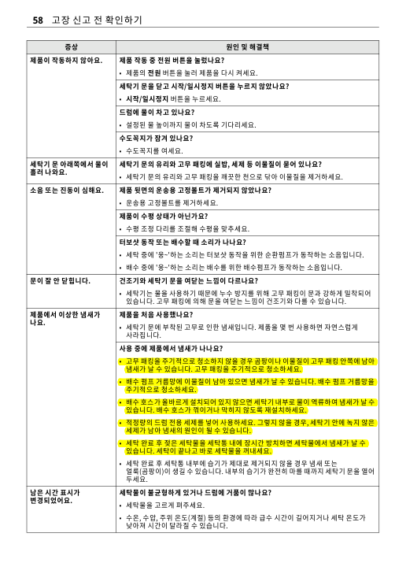

PDF 57쪽 · 형광펜 청크: `p57-c2`

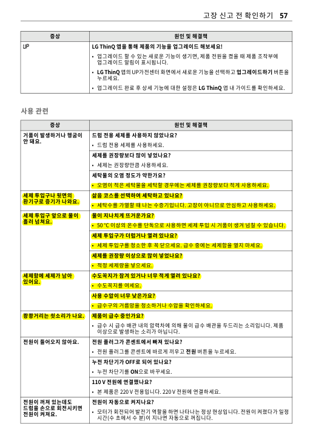

PDF 39쪽 · 형광펜 청크: `p39-c1`

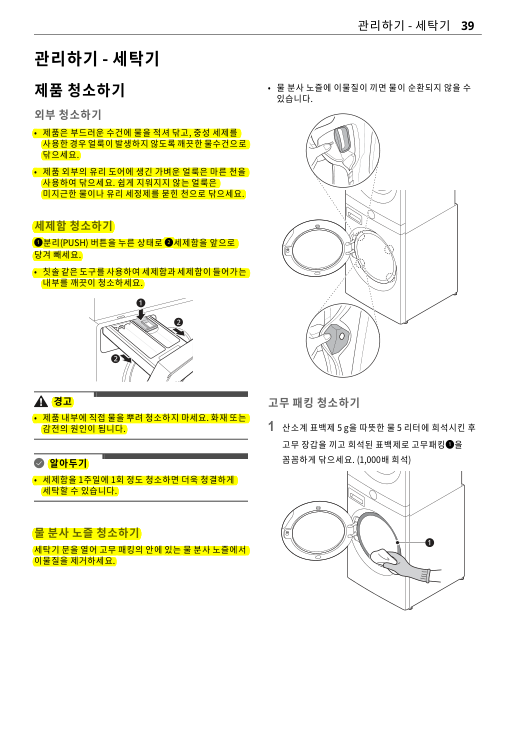

PDF 6쪽 · 형광펜 청크: `p6-c1`

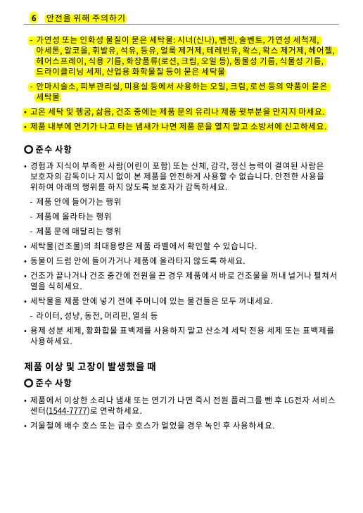

PDF 9쪽 · 형광펜 청크: `p9-c1`

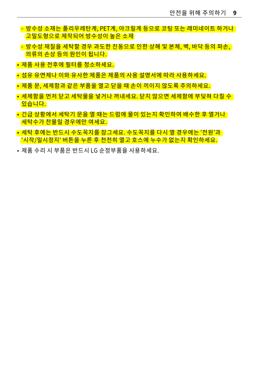

PDF 5쪽 · 형광펜 청크: `p5-c3`

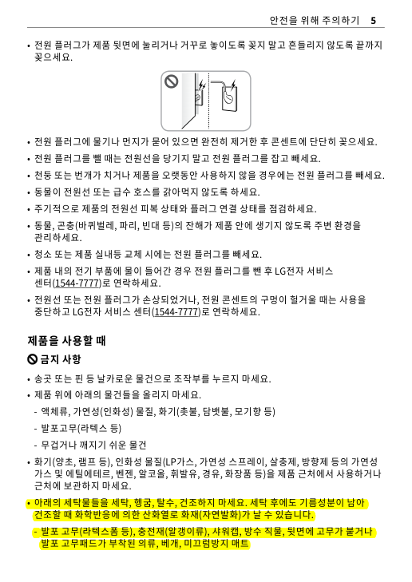

### Q02 · 통살균 코스는 얼마나 자주 해야 하나요?

**답변** (판단: 추가 확인 필요)

> 판단: 추가 확인 필요
> 이유: 상담에 필요한 증상 정보가 아직 없습니다.
>
> 안녕하세요. 워시타워 세탁기 사용설명서를 근거로 자가 점검을 안내해 드립니다. 어떤 증상인지 알려주시겠어요? 표시부에 오류코드(예: OE, IE)가 보인다면 함께 알려주시면 더 정확히 안내해 드릴 수 있습니다.

※ 이 문항은 상담 흐름에서 검색 없이 종료되어, 아래 청크는 평가용으로 같은 질문을 검색한 결과이며 모델에는 전달되지 않았습니다.

<b>검색된 Top-8 청크 원문</b>

| 순위 | 청크 | 페이지 | 유사도 | 답변 인용 | 본문 |
|---|---|---|---|---|---|
| 1 | `p41-c3` | 41쪽 | 0.546 | - | • 통살균 코스 진행 시 세탁물을 넣지 마세요. 통살균 코스는 빈통으로 작동하는 코스로, 세탁물을 넣을 경우 살균 효과 저하 및 세탁물이 심각하게 손상될 수 있습니다. 알아두기 • 드럼 청소 시점 자동 알림 기능 - 드럼 청소 시점 자동 알림 표시는 일반적으로 약 30회 사용 후 1번씩 나타납니다. - 전원 버튼을 눌러 전원을 켰을 때 남은 시간 표시창에 [tcL]이 깜빡 거리면 드럼 청소 시점을 알려주는 것이므로 통살균 버튼을 눌러 통살균을 진행하세요. - 통살균을 진행하면 다음 청소 시점까지는 [ tcL]이 나타나지 않습니다. - 통살균 코스를 진행하지 않고 세탁을 하려면 세탁하기 과정과 동일하게 진행하면 됩니다. • 세탁 후 드럼 내부에 습기가 제대로 제거되지 않을 경우 냄새 또는 얼룩(곰팡이)이 생길 수 있습니다. 내부의 습기가 완전히 마를 때까지 세탁기 문을 여세요. |
| 2 | `p41-c2` | 41쪽 | 0.539 | - | • 통살균 코스가 선택되면 화면에 [ tcL]이 표시됩니다. 시작/일시정지 버튼을 누르면 통살균 코스가 시작됩니다. 경고 • 어린이 또는 동물이 드럼 안에 들어가지 않도록 주의하세요. 상해 또는 질식의 원인이 됩니다. 주의 • 염소계 성분이 들어 있는 세탁조 클리너와 산성의 세탁조 클리너를 사용하여 통살균 코스를 진행하면 제품 안이 변색되거나 부식될 수 있습니다. 산소계 성분이 들어 있는 세탁조 클리너를 사용하세요. • 세탁조 클리너를 제조사 권장량보다 많이 넣어 통살균 코스를 진행하면 제품 안이 변색되거나 부식될 수 있습니다. 세탁조 클리너는 제조사 권장량에 맞게 넣어 사용하세요. • 통살균 코스 진행 시 세탁물을 넣지 마세요. 통살균 코스는 빈통으로 작동하는 코스로, 세탁물을 넣을 경우 살균 효과 저하 및 세탁물이 심각하게 손상될 수 있습니다. 알아두기 |
| 3 | `p42-c1` | 42쪽 | 0.456 | - | 42 관리하기 - 세탁기 알아두기 • 6개월 이상 통살균을 사용하지 않은 경우 통살균 코스를 연속으로(3회 이상) 진행하세요. 1회만 진행 시 덜 제거된 이물이 다음 세탁 시 의류에 붙어 나올 수 있습니다. • 장기간 세탁기를 사용하지 않을 경우 세탁물 없이 통살균 코스를 진행한 뒤에 문을 열어 두세요. • 스테인리스 드럼은 녹이 잘 생기지 않으나 다음의 경우에는 녹이 생길 수 있으니 주의하세요. 녹이 발생하면 스폰지나 부드러운 천에 세정제(중성 세제)를 묻혀서 닦으세요. (금속 수세미는 사용하지 마세요.) - 녹이 쉽게 발생하는 철제품(옷핀, 머리핀 등)이 드럼에 장시간 방치된 경우 - 철분이 많은 물을 장기간 사용한 경우 - 세탁 시 사용한 표백제가 장시간 드럼에 방치된 경우 • 과도한 거품이 생기는 세탁조 클리너는 누수가 발생할 수 있습니다. 세탁조 클리너의 사용량을 줄이거나,거품이 적게 생기는 세탁조 클리너 사용을 권장합니다. |
| 4 | `p41-c1` | 41쪽 | 0.395 | - | 41관리하기 - 세탁기 4 청소가 끝나면 호스 마개와 배수 펌프 마개를 제자리에 조립하고 서비스 커버를 닫으세요. • 잔수 제거용 호스는 밀어 넣지 말고 제자리에 꽂으세요. • 배수 펌 프 마개 는 누 수가 발 생할 수 있 으므 로 조 립 시 주의하세요. 주의 • 배수 펌프 마개를 열기 전 드럼 안에 뜨거운 물이 있는지 먼저 확인하세요. 뜨거운 물이 쏟아져 화상을 입을 수 있습니다. • 호스 마개와 배수 펌프 마개를 정확하게 조립하지 않으면 누수의 원인이 됩니다. 제품 관리하기 통살균 사용하기 세탁기 내부에 발생된 균들을 살균하여 깨끗하고 청결함을 유지하기 위해 드럼을 청소하세요. 1 세탁조 클리너(세정제) 사용 시 제조사별 표준 사용량에 맞는 양을 세제 투입구에 넣으세요. (세탁 세제 및 섬유 유연제를 넣지 마세요. 거품이 많이 생기거나 살균 효과가 떨어질 수 있습니다.) 2 통살균 코스를 사용하여 드럼을 청소하세요. |
| 5 | `p56-c3` | 56쪽 | 0.361 | - | • 전원 플러그를 뺀 후 LG전자 서비스 센터(1544-7777 )에 문의하세요. vs 탈수가 안 되나요? • 진동 센서에 이상이 있을 경우 vs가 나타납니다. 전원 플러그를 뺀 후 LG전자 서비스 센터(1544-7777)에 문의하세요. FF 급수 호스나 배수 호스, 배수 펌프가 얼어 있나요? • 관리하기 - 세탁기 의 겨울철 동결 관리하기 를 참고하세요. tcL 1~2개월 내에 드럼을 청소하지 않았나요? • 통살균 코스를 진행하세요. - 통살균 코스를 진행하지 않고 일반 세탁을 하려면 코스 선택 버튼을 눌러 원하는 코스를 선택하세요. [L 버튼을 눌러도 버튼이 작동하지 않나요? • 버튼잠금 기능이 설정되어 있는지 확인하세요. 버튼잠금 기능을 해제하려면 버튼잠금 버튼을 3초간 누르세요. 증상 원인 및 해결책 |
| 6 | `p57-c2` | 57쪽 | 0.354 | - | • 오염이 적은 세탁물을 세탁할 경우에는 세제를 권장량보다 적게 사용하세요. 세제 투입구나 뒷면의 환기구로 증기가 나와요. 삶음 코스를 선택하여 세탁하고 있나요? • 세탁수를 가열할 때 나는 수증기입니다. 고장이 아니므로 안심하고 사용하세요. 세제 투입구 앞으로 물이 흘러 넘쳐요. 물이 지나치게 뜨거운가요? • 50 ℃ 이상의 온수를 단독으로 사용하면 세제 투입 시 거품이 생겨 넘칠 수 있습니다. 세제 투입구가 더럽거나 열려 있나요? • 세제 투입구를 청소한 후 꼭 닫으세요. 급수 중에는 세제함을 열지 마세요. 세제를 권장량 이상으로 많이 넣었나요? • 적정 세제량을 넣으세요. 세제함에 세제가 남아 있어요. 수도꼭지가 잠겨 있거나 너무 적게 열려 있나요? • 수도꼭지를 여세요. 사용 수압이 너무 낮은가요? • 급수구의 거름망을 청소하거나 수압을 확인하세요. 쾅쾅거리는 쇳소리가 나요. 제품이 급수 중인가요? |
| 7 | `p22-c1` | 22쪽 | 0.328 | - | 22 사용하기 - 세탁기 • 세제량은 세제 제조사 권장량의 절반만 사용하세요. • 냉수 호스만 연결되어 있어도 본 코스 사용이 가능합니다. 제품 자체의 가열 시스템으로 물을 가열하여 사용합니다. • 냉수 호스만 연결되어 있거나 온수 호스의 수도꼭지가 잠겨있을 경우에는 설정 온도보다 낮게 가열될 수 있습니다. • 온수가 공급되면 에너지 절약에 효과적입니다. • 물온도는 95 ℃ 로 기본 설정됩니다. • 배수 온도 낮춤 기능: 알뜰삶음 세탁 후 냉수를 짧게 여러 번 반복 급수함으로써 갑자기 냉수가 공급되어 세탁물이 손상되는 것을 방지하고 배수되는 온도를 낮추어 줍니다. • 거품 제거 기능: 세제를 과다하게 사용할 경우 거품 제거 기능이 작동할 수 있습니다. 소량급속 (최대용량: 1 kg) 오염 부위가 적은 소량의 세탁물을 빠른 시간 내에 세탁해주는 코스 • 오염 부위가 적은 소량의 세탁물을 세탁하므로 세제량은 세제 제조사 권장량의 절반만 사용하세요. |
| 8 | `p41-c4` | 41쪽 | 0.323 | - | • 세탁 후 드럼 내부에 습기가 제대로 제거되지 않을 경우 냄새 또는 얼룩(곰팡이)이 생길 수 있습니다. 내부의 습기가 완전히 마를 때까지 세탁기 문을 여세요. • 아래와 같은 환경에서 제품을 오랫동안 사용하면 공기 중의 균이나 곰팡이가 물때에 달라붙어 드럼이 오염되며 냄새가 날 수 있습니다. 드럼의 오염이 심해지면 청소가 어려우므로 월 1회 이상 통살균 코스를 통해 세탁통을 청소하세요. - 주위 환경이 습하고 그늘진 장소에 설치한 경우 - 오랜 기간 동안 제품의 사용 또는 관리가 없는 경우 - 세제 또는 섬유 유연제를 과도하게 사용하는 경우 - 천연 세제(세탁 비누)를 사용하는 경우 • 사용 조건과 환경에 따라 드럼 내부의 오염 발생 정도 또는 통살균 코스의 예방 효과가 다를 수 있습니다. |

**답변이 인용한 페이지**: 없음

<b>검색됐지만 인용되지 않은 페이지 5개</b> (41쪽, 42쪽, 56쪽, 57쪽, 22쪽)

PDF 41쪽 · 형광펜 청크: `p41-c3`, `p41-c2`, `p41-c1`, `p41-c4`

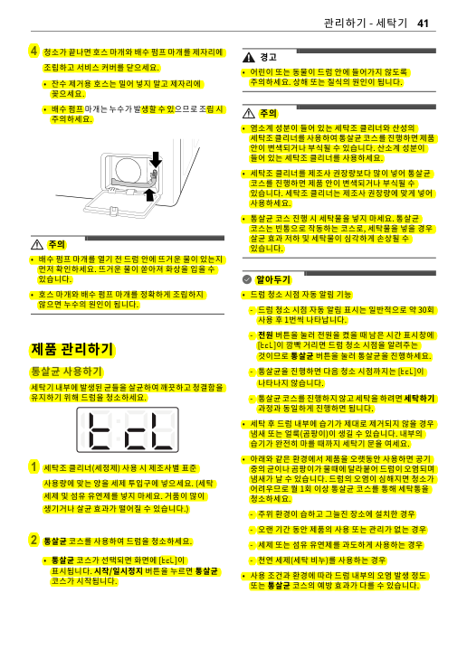

PDF 42쪽 · 형광펜 청크: `p42-c1`

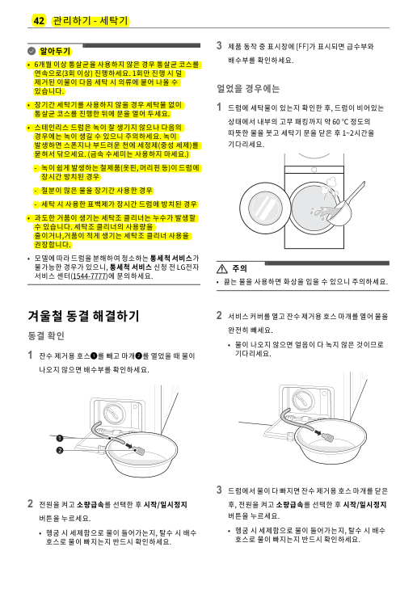

PDF 56쪽 · 형광펜 청크: `p56-c3`

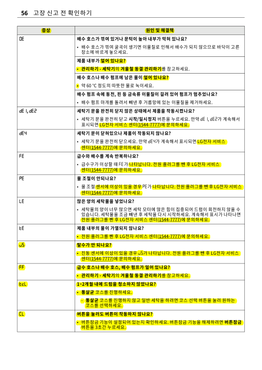

PDF 57쪽 · 형광펜 청크: `p57-c2`

PDF 22쪽 · 형광펜 청크: `p22-c1`

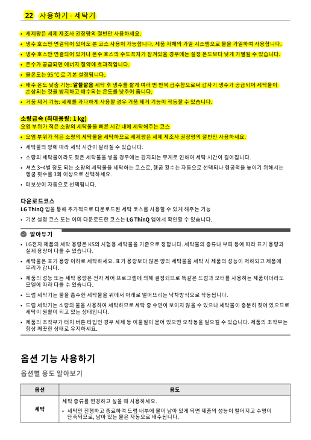

### Q03 · 빨래를 다 하고 꺼냈는데 옷에서 쉰내가 나요.

**답변** (판단: 자가 점검 우선)

> 판단: 자가 점검 우선
> 이유: 세탁 후 세탁물을 장시간 방치하면 냄새가 날 수 있습니다.
>
> 세탁이 끝난 후에는 세탁물을 바로 꺼내는 것이 좋습니다. 또한, 세탁통 내부의 습기가 제대로 제거되지 않으면 냄새가 생길 수 있으니, 세탁이 끝난 후에는 문을 열어 두어 내부의 습기가 완전히 마를 수 있도록 해주세요. 이와 관련된 내용은 [PDF 58쪽]에서 확인하실 수 있습니다.

<b>검색된 Top-8 청크 원문</b>

| 순위 | 청크 | 페이지 | 유사도 | 답변 인용 | 본문 |
|---|---|---|---|---|---|
| 1 | `p17-c2` | 17쪽 | 0.403 | - | • 부분 얼룩 또는 찌든 때는 세탁 전에 전용 세제로 손질하세요. • 긴 끈이 부착된 옷의 경우 끈을 정리하거나 세탁망에 넣어서 세탁하세요. • 슬리브, 스타킹, 타이즈, 속옷, 양말 같은 크기가 작은 세탁물의 경우 드럼 틈새에 낄 수 있으므로 세탁망을 이용하여 세탁하세요. 세탁망은 절반 정도만 세탁물을 채워서 사용하세요. • 세탁망의 절반 이하로 세탁물을 채우고, 다른 의류와 함께 넣어서 세탁하세요. 세탁망을 가득 채우거나 세탁망을 단독으로 사용할 경우 치우침에 의해 탈수 이상 현상이 생길 수 있습니다. • 베개, 쿠션, 방석 등은 내용물을 제거하고 커버만 세탁하세요. 내용물이 튀어나오면 세탁물의 손상, 플라스틱 부품의 손상, 이상 진동의 원인이 됩니다. • 색깔이 있는 의류와 흰 의류, 보푸라기가 많이 생기는 의류는 분리하여 세탁하세요. |
| 2 | `p17-c3` | 17쪽 | 0.368 | - | • 색깔이 있는 의류와 흰 의류, 보푸라기가 많이 생기는 의류는 분리하여 세탁하세요. • 이불은 일반 세탁물과 분리하여 한 장씩 세탁하세요. 두 장 이상 세탁할 경우 서로 엉키거나 치우침에 의해 세탁이 잘 안되거나 탈수 이상 현상이 생길 수 있습니다. • 전기 담요, 카펫, 커튼, 발 닦이용 발판, 고무 매트 등은 세탁하지 마세요. • 니트류는 2벌 이상 세탁하세요. 크기는 작아도 물을 많이 흡수하는 세탁물의 경우 1벌만 세탁하면 치우침에 의해 세탁이 잘 안되거나 탈수 이상 현상이 생길 수 있습니다. 세탁이 끝나면 세탁물을 바로 꺼내세요. 세탁물을 드럼 안에 장시간 방치하면 냄새가 날 수 있습니다. 구분 세탁 전 세탁 후 켆잫픦헖짦핂옪 풚컪칺푷켆푢 |
| 3 | `p58-c4` | 58쪽 | 0.344 | O | • 세탁 완료 후 젖은 세탁물을 세탁통 내에 장시간 방치하면 세탁물에서 냄새가 날 수 있습니다. 세탁이 끝나고 바로 세탁물을 꺼내세요. • 세탁 완료 후 세탁통 내부에 습기가 제대로 제거되지 않을 경우 냄새 또는 얼룩(곰팡이)이 생길 수 있습니다. 내부의 습기가 완전히 마를 때까지 세탁기 문을 열어 두세요. 남은 시간 표시가 변경되었어요. 세탁물이 불균형하게 있거나 드럼에 거품이 많나요? • 세탁물을 고르게 펴주세요. • 수온, 수압, 주위 온도(계절) 등의 환경에 따라 급수 시간이 길어지거나 세탁 온도가 낮아져 시간이 달라질 수 있습니다. 증상 원인 및 해결책 |
| 4 | `p19-c1` | 19쪽 | 0.343 | - | 19사용하기 - 세탁기 • 세탁 시 재생비누를 사용하지 마세요. 재생비누의 성분들이 세탁기 내부에 쌓여서 계속 사용하면 오염이 생길 수 있습니다. • 건조기용 오일, 아로마 오일 등 각종 오일류를 세제함(세제 또는 유연제)에 넣지 마세요. 알아두기 • 애벌 세탁 옵션 설정 시, 가루 세제 사용을 권장합니다. 액체 세제를 사용하면 세탁 전에 세제가 흘러 들어갈 수 있습니다. • 속옷(면)이나 아기의 옷(면)에 묻은 오염은 피지(지방류)나 단백질 성분이 대부분이므로 세제를 많이 사용하는 것보다 다소 높은 온도에서 세탁한 후 헹굼 횟수를 늘리는 것이 효과적입니다. • 급수 시간이 짧으므로 세탁 시작 전에 미리 세제를 넣으세요. • 가루 세제 사용 시, 세제함이 젖어 있으면 세제가 세제함에 남을 수 있으니 사용 전 물기를 제거하세요. |
| 5 | `p18-c3` | 18쪽 | 0.342 | - | • 의류의 종류, 크기, 색상, 직물 짜임, 세탁 코스 등에 따라 세탁 시간이나 세탁 종류가 다르므로 세탁물을 알맞게 분류하여 세탁하세요. • 수건, 합성 섬유로 된 의류는 보풀이 많이 생길 수 있으므로 다른 세탁물과 분리하여 세탁하세요. • 세탁 코스별 세탁물 분류 방법은 세탁 코스 사용하기 를 참고하세요. 알아두기 • 아래의 세탁물들은 세탁기로 세탁하면 수축 또는 변형될 수 있습니다. 세탁 라벨을 확인하여 세탁 시 주의하세요. - 한복 또는 한복 천이 포함된 세탁물 - 신발, 가죽 제품, 넥타이, 양복, 코트 등 드라이 클리닝 전용 의류 - 장식품이 달린 세탁물 - 인위적인 주름이 있는 세탁물 - 견, 양모, 레이온, 아세테이트 등 물이 닿으면 줄어들거나 색이 변하는 섬유가 포함된 겉옷 - 그 외 물에 담그는 것만으로도 변형, 변색되기 쉬운 세탁물(세탁 라벨 참고) 세제 또는 섬유 유연제 사용하기 세제 사용하기 |
| 6 | `p17-c1` | 17쪽 | 0.341 | - | 17사용하기 - 세탁기 알아두기 • 사용 설명서의 내용대로 사용하지 않아 발생하는 사고는 당사가 책임지지 않습니다. 세탁물 •세 탁 물 에 부 착 된 취급표시 를 확인하여 물세탁이 가능한 의류만 세탁하세요. • 지퍼, 후크, 단추 등은 잠근 후 뒤집어서 세탁하세요. • 콜드크림 또는 마사지 오일 등의 식물성 기름이 묻은 의류는 세탁하지 마세요. • 금속류의 이물질이 들어가면 세탁기 문의 유리가 파손되거나 드럼이 깨져 심각한 누수가 생길 수 있으며 세탁물이 손상되거나 드럼 안에서 시끄러운 소리가 날 수 있습니다. 세탁물의 주머니를 확인하여 동전, 머리핀, 열쇠 등 주머니에 들어 있는 소지품을 꺼내세요. • 세탁물에 묻은 흙, 먼지, 모래 등은 다른 의류도 오염시킬 수 있으니 세탁 전에 터세요. • 부분 얼룩 또는 찌든 때는 세탁 전에 전용 세제로 손질하세요. • 긴 끈이 부착된 옷의 경우 끈을 정리하거나 세탁망에 넣어서 세탁하세요. |
| 7 | `p24-c3` | 24쪽 | 0.340 | - | • 드럼이 회전 중인 경우 드럼이 정지하고 나서 문잠김이 해제됩니다. • 드럼 내 물의 온도가 높은 경우 온도가 내려갈 때까지 기다리세요. • 세탁기 히터가 작동하는 과정에서 문을 열면, 내부의 수증기가 빠져나올 수 있습니다. 이는 제품의 이상이 아닌 정상적인 현상이므로 안심하고 사용하세요. • 세제와 표백제를 동시에 투입할 경우, 냄새나 연기가 발생할 수 있습니다. 옵션 용도 |
| 8 | `p21-c4` | 21쪽 | 0.335 | - | • 세탁물에 알맞은 중성 세제를 사용하세요. • 옷감 손상을 방지하기 위하여 드럼이 가끔씩 짧은 간격으로 회전하기 때문에 세탁 시 드럼의 움직임이 거의 없는 것 처럼 느껴질 수 있습니다. 이는 제품의 불량이 아니라 섬세한 섬유의 특성을 고려하여 움직임이 적게 회전하도록 작동되기 때문입니다. • 의류의 물 세탁 가능 여부를 확인한 후, 물 세탁이 가능한 의류만 세탁하세요. 알뜰삶음 (최대용량: 3 kg) 순면, 속옷류, 아기옷을 삶는 세탁을 해주는 코스 |

**답변이 인용한 페이지**

PDF 58쪽 · 형광펜 청크: `p58-c4`

<b>검색됐지만 인용되지 않은 페이지 5개</b> (17쪽, 19쪽, 18쪽, 24쪽, 21쪽)

PDF 17쪽 · 형광펜 청크: `p17-c2`, `p17-c3`, `p17-c1`

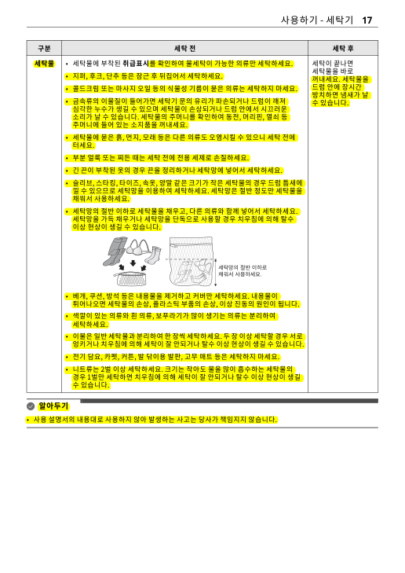

PDF 19쪽 · 형광펜 청크: `p19-c1`

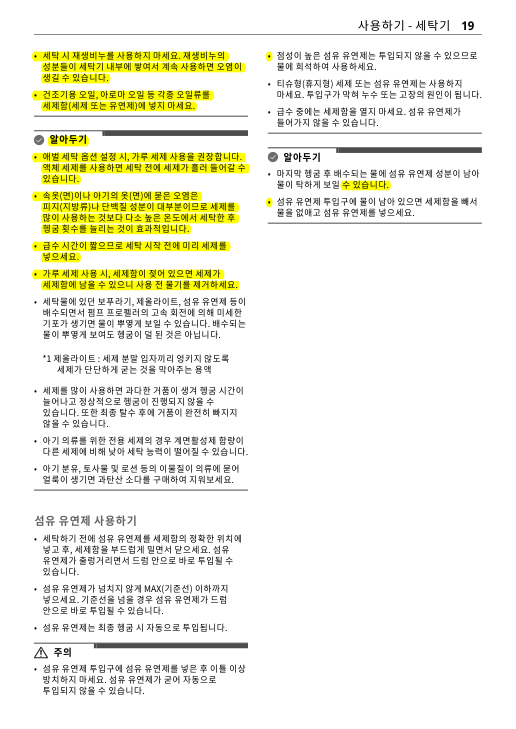

PDF 18쪽 · 형광펜 청크: `p18-c3`

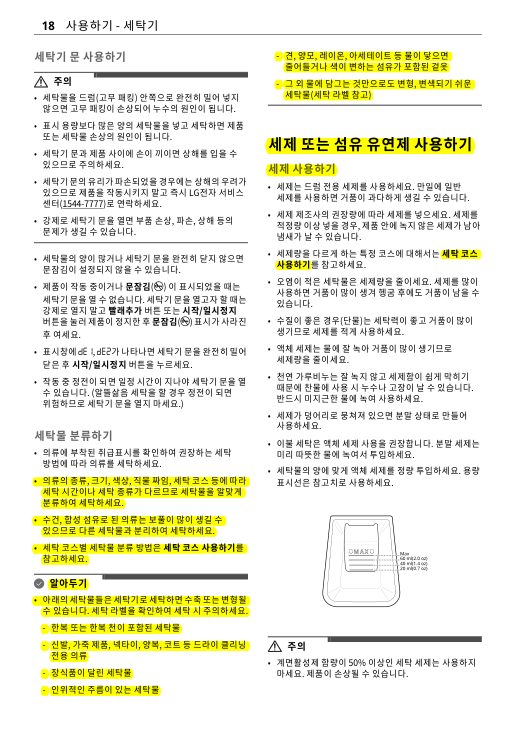

PDF 24쪽 · 형광펜 청크: `p24-c3`

PDF 21쪽 · 형광펜 청크: `p21-c4`

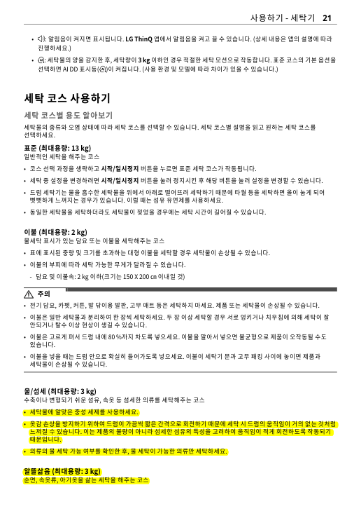

### Q04 · 탈수할 때 세탁기가 덜덜거리면서 자리에서 조금씩 움직여요.

**답변** (판단: 자가 점검 우선)

> 판단: 자가 점검 우선
> 이유: 탈수 시 세탁물이 한쪽으로 치우쳐져 소음과 진동이 발생할 수 있습니다.
>
> 세탁물을 고르게 펴서 한 번 더 탈수해 보세요. 세탁물의 양이 너무 적거나 한쪽으로 치우쳐져 있지 않은지 확인해 주세요. [PDF 59쪽]

<b>검색된 Top-8 청크 원문</b>

| 순위 | 청크 | 페이지 | 유사도 | 답변 인용 | 본문 |
|---|---|---|---|---|---|
| 1 | `p59-c1` | 59쪽 | 0.529 | O | 59고장 신고 전 확인하기 남은 시간 표시가 변경되었어요. 제품 작동 중 일시정지 후 코스를 변경하거나 다른 기능을 선택했나요? • 세탁 코스 변경, 기능의 추가/제거에 따라 세탁 시간이 변경됩니다. 탈수가 끝나도 세탁물이 축축해요. 탈수 시 세탁물이 한쪽으로 치우쳐 있나요? • 탈수 시 세탁물이 한쪽으로 치우치면 소음 또는 진동이 커져 자동으로 회전수를 낮추므로 탈수가 덜 될 수도 있습니다. 세탁물을 고르게 펴서 한 번 더 탈수하세요. 세탁물의 양이 너무 적나요? • 세탁물의 양이 너무 적으면 세탁물이 한쪽으로 뭉쳐 소음 또는 진동이 커지므로 자동으로 회전수를 낮춰 탈수가 되므로 탈수가 덜 될 수도 있습니다. 세탁물 몇 개를 모아 탈수하세요. 탈수 시 쿵쾅거리다가 멈추고 다시 탈수를 반복해요. 세탁물을 종류별로 분류하지 않았나요? |
| 2 | `p59-c2` | 59쪽 | 0.527 | O | • 탈수 시 세탁물이 한쪽으로 치우쳐지면 소음 또는 진동의 원인이 되므로 자동으로 조정하는 것입니다. 세탁물을 종류별로 나누어서 탈수하세요. 탈수 시간이 길어져요. 세탁물이 한쪽으로 치우쳐 있나요? • 탈수 시 세탁물이 한쪽으로 치우쳐지면 소음 또는 진동의 원인이 되므로 자동으로 조정하는 것입니다. 탈수 시간이 30분 정도 지연될 수 있습니다. 세탁물을 종류별로 나누어서 탈수하세요. 증상 원인 및 해결책 |
| 3 | `p24-c1` | 24쪽 | 0.516 | - | 24 사용하기 - 세탁기 헹굼+탈수 세탁은 하지 않고 헹굼부터 탈수까지 하고 싶을 때 사용하세요. 1) 전원 버튼을 누르세요. 2) 세탁 코스를 선택하세요. 3) 물온도 버튼을 3초간 누르세요. 4) 시작/일시정지 버튼을 누르세요. 알아두기 • 세제는 넣지 말고 섬유 유연제만 넣으세요. • 물 온도는 선택되지 않으며, 냉수가 자동으로 공급됩니다. 빨래추가 세탁기 작동 중 세탁물을 추가로 투입하거나 이물질을 제거하고 싶을 때 사용하세요. 1) 터보샷 버튼을 3초간 누르세요. 제품이 작동을 멈춥니다. • 세탁기 작동 중에 선택 가능하며, 드럼 내 수위가 높거나 내부 온도가 45 ℃ 이상일 경우에는 문잠김이 해제되지 않을 수 있습니다. |
| 4 | `p21-c2` | 21쪽 | 0.503 | - | • 세탁 중 설정을 변경하려면 시작/일시정지 버튼을 눌러 정지시킨 후 해당 버튼을 눌러 설정을 변경할 수 있습니다. • 드럼 세탁기는 물을 흡수한 세탁물을 위에서 아래로 떨어뜨려 세탁하기 때문에 타월 등을 세탁하면 올이 눕게 되어 뻣뻣하게 느껴지는 경우가 있습니다. 이럴 때는 섬유 유연제를 사용하세요. • 동일한 세탁물을 세탁하더라도 세탁물이 젖었을 경우에는 세탁 시간이 길어질 수 있습니다. 이불 (최대용량: 2 kg) 물세탁 표시가 있는 담요 또는 이불을 세탁해주는 코스 • 표에 표시된 중량 및 크기를 초과하는 대형 이불을 세탁할 경우 세탁물이 손상될 수 있습니다. • 이불의 부피에 따라 세탁 가능한 무게가 달라질 수 있습니다. - 담요 및 이불속: 2 kg 이하(크기는 150 X 200 ㎝ 이내일 것) 주의 • 전기 담요, 카펫, 커튼, 발 닦이용 발판, 고무 매트 등은 세탁하지 마세요. 제품 또는 세탁물이 손상될 수 있 습니다. |
| 5 | `p58-c4` | 58쪽 | 0.489 | - | • 세탁 완료 후 젖은 세탁물을 세탁통 내에 장시간 방치하면 세탁물에서 냄새가 날 수 있습니다. 세탁이 끝나고 바로 세탁물을 꺼내세요. • 세탁 완료 후 세탁통 내부에 습기가 제대로 제거되지 않을 경우 냄새 또는 얼룩(곰팡이)이 생길 수 있습니다. 내부의 습기가 완전히 마를 때까지 세탁기 문을 열어 두세요. 남은 시간 표시가 변경되었어요. 세탁물이 불균형하게 있거나 드럼에 거품이 많나요? • 세탁물을 고르게 펴주세요. • 수온, 수압, 주위 온도(계절) 등의 환경에 따라 급수 시간이 길어지거나 세탁 온도가 낮아져 시간이 달라질 수 있습니다. 증상 원인 및 해결책 |
| 6 | `p17-c2` | 17쪽 | 0.489 | - | • 부분 얼룩 또는 찌든 때는 세탁 전에 전용 세제로 손질하세요. • 긴 끈이 부착된 옷의 경우 끈을 정리하거나 세탁망에 넣어서 세탁하세요. • 슬리브, 스타킹, 타이즈, 속옷, 양말 같은 크기가 작은 세탁물의 경우 드럼 틈새에 낄 수 있으므로 세탁망을 이용하여 세탁하세요. 세탁망은 절반 정도만 세탁물을 채워서 사용하세요. • 세탁망의 절반 이하로 세탁물을 채우고, 다른 의류와 함께 넣어서 세탁하세요. 세탁망을 가득 채우거나 세탁망을 단독으로 사용할 경우 치우침에 의해 탈수 이상 현상이 생길 수 있습니다. • 베개, 쿠션, 방석 등은 내용물을 제거하고 커버만 세탁하세요. 내용물이 튀어나오면 세탁물의 손상, 플라스틱 부품의 손상, 이상 진동의 원인이 됩니다. • 색깔이 있는 의류와 흰 의류, 보푸라기가 많이 생기는 의류는 분리하여 세탁하세요. |
| 7 | `p23-c2` | 23쪽 | 0.483 | - | • 급수 수압에 따라 물줄기의 분사 모양이 달라질 수 있습니다. • 세탁 과정에 따라 터보샷 동작이 달라질 수 있습니다. • 일부 코스는 세탁 과정에 따라 세탁 시간이 줄지 않습니다. 건조준비 세탁이 완료되기 전에 건조를 미리 준비하고 싶을 때 사용하세요. 1) 세탁기 전원 버튼을 누르세요. 2) 원하는 세탁 코스를 선택하세요. 3) 건조준비 버튼을 누르세요. 4) 세탁기 시작/일시정지 버튼을 눌러 세탁을 시작하세요. • 건조준비 기능은 건조 시 공기를 빠르게 데울 수 있도록 미리 준비하는 기능입니다. • 세탁기를 시작하기 전 건조준비 기능을 선택한 후 세탁을 시작하세요. • 건조기의 전원이 켜지고 선택한 세탁 코스에 매칭되는 건조 코스 및 옵션이 표시됩니다. |
| 8 | `p6-c3` | 6쪽 | 0.480 | - | • 세탁물을 제품 안에 넣기 전에 주머니에 있는 물건들은 모두 꺼내세요. - 라이터, 성냥, 동전, 머리핀, 열쇠 등 • 용제 성분 세제, 황화합물 표백제를 사용하지 말고 산소계 세탁 전용 세제 또는 표백제를 사용하세요. 제품 이상 및 고장이 발생했을 때 j 준수 사항 • 제품에서 이상한 소리나 냄새 또는 연기가 나면 즉시 전원 플러그를 뺀 후 LG전자 서비스 센터(1544-7777)로 연락하세요. • 겨울철에 배수 호스 또는 급수 호스가 얼었을 경우 녹인 후 사용하세요. |

**답변이 인용한 페이지**

PDF 59쪽 · 형광펜 청크: `p59-c1`, `p59-c2`

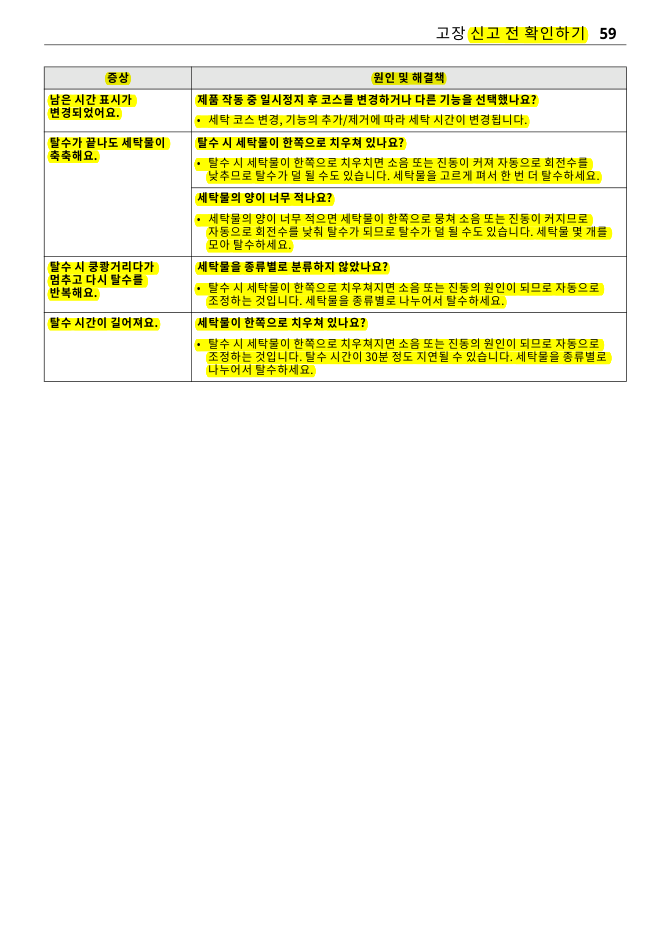

<b>검색됐지만 인용되지 않은 페이지 6개</b> (24쪽, 21쪽, 58쪽, 17쪽, 23쪽, 6쪽)

PDF 24쪽 · 형광펜 청크: `p24-c1`

PDF 21쪽 · 형광펜 청크: `p21-c2`

PDF 58쪽 · 형광펜 청크: `p58-c4`

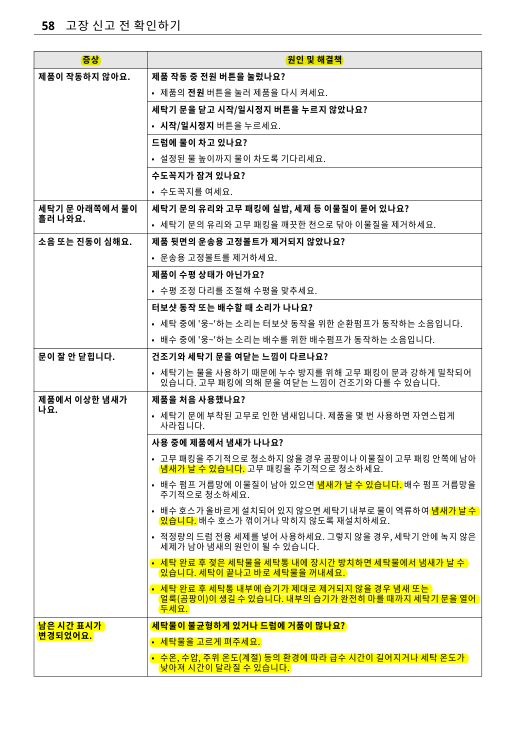

PDF 17쪽 · 형광펜 청크: `p17-c2`

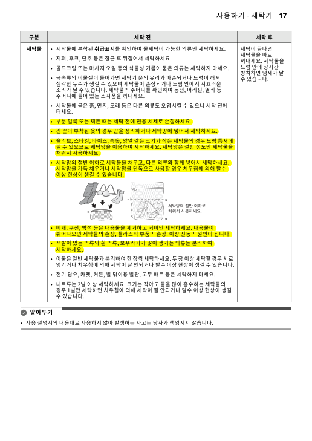

PDF 23쪽 · 형광펜 청크: `p23-c2`

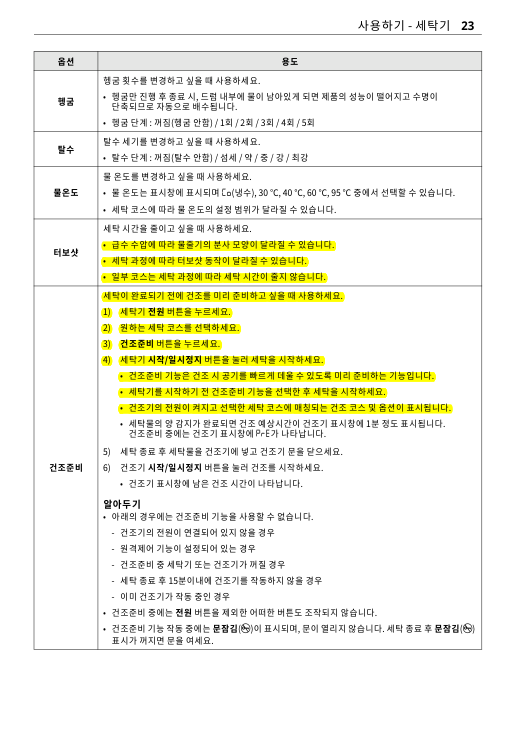

PDF 6쪽 · 형광펜 청크: `p6-c3`

### Q05 · 세탁기 화면에 1E라고 떠요. 어떻게 해야 하나요?

**답변** (판단: 자가 점검 우선)

> 판단: 자가 점검 우선
> 이유: 고객님께서 1E 오류코드를 말씀하셨고, 이는 급수구 거름망이 막혔을 때 나타나는 코드입니다.
>
> 먼저 수도꼭지를 잠근 후, 제품 뒤쪽에 연결된 급수 호스를 분리해 주세요. 그 다음 거름망을 손이나 집게로 빼내어 칫솔 같은 도구로 오물을 제거해 주시기 바랍니다. 이 절차는 [PDF 40쪽]에 안내되어 있습니다.

<b>검색된 Top-8 청크 원문</b>

| 순위 | 청크 | 페이지 | 유사도 | 답변 인용 | 본문 |
|---|---|---|---|---|---|
| 1 | `p56-c2` | 56쪽 | 0.545 | - | • 세탁기 문을 완전히 닫으세요. 만약 dE4가 계속해서 표시되면 LG전자 서비스 센터(1544-7777)에 문의하세요. FE 급수와 배수를 계속 반복하나요? • 급수구가 이상할 때 FE가 나타납니다. 전원 플러그를 뺀 후 LG전자 서비스 센터(1544-7777)에 문의하세요. PE 물 조절이 안되나요? • 물 조절 센서에 이상이 있을 경우 PE가 나타납니다. 전원 플러그를 뺀 후 LG전자 서비스 센터(1544-7777)에 문의하세요. LE 많은 양의 세탁물을 넣었나요? • 세탁물의 양이 너무 많으면 세탁 모터에 많은 힘이 집중되어 드럼이 회전하지 않을 수 있습니다. 세탁물을 조금 빼낸 후 세탁을 다시 시작하세요. 계속해서 표시가 나타나면 전원 플러그를 뺀 후 LG전자 서비스 센터(1544-7777 )에 문의하세요. tE 제품 내부의 물이 가열되지 않나요? • 전원 플러그를 뺀 후 LG전자 서비스 센터(1544-7777 )에 문의하세요. vs 탈수가 안 되나요? |
| 2 | `p24-c1` | 24쪽 | 0.505 | - | 24 사용하기 - 세탁기 헹굼+탈수 세탁은 하지 않고 헹굼부터 탈수까지 하고 싶을 때 사용하세요. 1) 전원 버튼을 누르세요. 2) 세탁 코스를 선택하세요. 3) 물온도 버튼을 3초간 누르세요. 4) 시작/일시정지 버튼을 누르세요. 알아두기 • 세제는 넣지 말고 섬유 유연제만 넣으세요. • 물 온도는 선택되지 않으며, 냉수가 자동으로 공급됩니다. 빨래추가 세탁기 작동 중 세탁물을 추가로 투입하거나 이물질을 제거하고 싶을 때 사용하세요. 1) 터보샷 버튼을 3초간 누르세요. 제품이 작동을 멈춥니다. • 세탁기 작동 중에 선택 가능하며, 드럼 내 수위가 높거나 내부 온도가 45 ℃ 이상일 경우에는 문잠김이 해제되지 않을 수 있습니다. |
| 3 | `p18-c2` | 18쪽 | 0.499 | - | • 세탁물의 양이 많거나 세탁기 문을 완전히 닫지 않으면 문잠김이 설정되지 않을 수 있습니다. • 제품이 작동 중이거나 문잠김 (H) 이 표시되었을 때는 세탁기 문을 열 수 없습니다. 세탁기 문을 열고자 할 때는 강제로 열지 말고 빨래추가 버튼 또는 시작/일시정지 버튼을 눌러 제품이 정지한 후 문잠김 (H) 표시가 사라진 후 여세요. •표 시 창 에 dE1, dEz가 나타나면 세탁기 문을 완전히 밀어 닫은 후 시작/일시정지 버튼을 누르세요. • 작동 중 정전이 되면 일정 시간이 지나야 세탁기 문을 열 수 있습니다. (알뜰삶음 세탁을 할 경우 정전이 되면 위험하므로 세탁기 문을 열지 마세요.) 세탁물 분류하기 • 의류에 부착된 취급표시를 확인하여 권장하는 세탁 방법에 따라 의류를 세탁하세요. • 의류의 종류, 크기, 색상, 직물 짜임, 세탁 코스 등에 따라 세탁 시간이나 세탁 종류가 다르므로 세탁물을 알맞게 분류하여 세탁하세요. |
| 4 | `p21-c2` | 21쪽 | 0.498 | - | • 세탁 중 설정을 변경하려면 시작/일시정지 버튼을 눌러 정지시킨 후 해당 버튼을 눌러 설정을 변경할 수 있습니다. • 드럼 세탁기는 물을 흡수한 세탁물을 위에서 아래로 떨어뜨려 세탁하기 때문에 타월 등을 세탁하면 올이 눕게 되어 뻣뻣하게 느껴지는 경우가 있습니다. 이럴 때는 섬유 유연제를 사용하세요. • 동일한 세탁물을 세탁하더라도 세탁물이 젖었을 경우에는 세탁 시간이 길어질 수 있습니다. 이불 (최대용량: 2 kg) 물세탁 표시가 있는 담요 또는 이불을 세탁해주는 코스 • 표에 표시된 중량 및 크기를 초과하는 대형 이불을 세탁할 경우 세탁물이 손상될 수 있습니다. • 이불의 부피에 따라 세탁 가능한 무게가 달라질 수 있습니다. - 담요 및 이불속: 2 kg 이하(크기는 150 X 200 ㎝ 이내일 것) 주의 • 전기 담요, 카펫, 커튼, 발 닦이용 발판, 고무 매트 등은 세탁하지 마세요. 제품 또는 세탁물이 손상될 수 있 습니다. |
| 5 | `p18-c1` | 18쪽 | 0.493 | - | 18 사용하기 - 세탁기 세탁기 문 사용하기 주의 • 세탁물을 드럼(고무 패킹) 안쪽으로 완전히 밀어 넣지 않으면 고무 패킹이 손상되어 누수의 원인이 됩니다. • 표시 용량보다 많은 양의 세탁물을 넣고 세탁하면 제품 또는 세탁물 손상의 원인이 됩니다. • 세탁기 문과 제품 사이에 손이 끼이면 상해를 입을 수 있으므로 주의하세요. • 세탁기 문의 유리가 파손되었을 경우에는 상해의 우려가 있으므로 제품을 작동시키지 말고 즉시 LG전자 서비스 센터(1544-7777)로 연락하세요. • 강제로 세탁기 문을 열면 부품 손상, 파손, 상해 등의 문제가 생길 수 있습니다. • 세탁물의 양이 많거나 세탁기 문을 완전히 닫지 않으면 문잠김이 설정되지 않을 수 있습니다. |
| 6 | `p42-c2` | 42쪽 | 0.491 | - | • 과도한 거품이 생기는 세탁조 클리너는 누수가 발생할 수 있습니다. 세탁조 클리너의 사용량을 줄이거나,거품이 적게 생기는 세탁조 클리너 사용을 권장합니다. • 모델에 따라 드럼을 분해하여 청소하는 통세척 서비스 가 불가능한 경우가 있으니, 통세척 서비스 신청 전 LG전자 서비스 센터(1544-7777 )에 문의하세요. 겨울철 동결 해결하기 동결 확인 1 잔수 제거용 호스 a를 빼고 마개 b를 열었을 때 물이 나오지 않으면 배수부를 확인하세요. 2 전원을 켜고 소량급속 를 선택한 후 시작/일시정지 버튼을 누르세요. • 헹굼 시 세제함으로 물이 들어가는지, 탈수 시 배수 호스로 물이 빠지는지 반드시 확인하세요. 3 제품 동작 중 표시창에 [ FF]가 표시되면 급수부와 배수부를 확인하세요. 얼었을 경우에는 1 드럼에 세탁물이 있는지 확인한 후, 드럼이 비어있는 상태에서 내부의 고무 패킹까지 약 60 ℃ 정도의 따뜻한 물을 붓고 세탁기 문을 닫은 후 1~2시간을 기다리세요. 주의 |
| 7 | `p40-c1` | 40쪽 | 0.490 | O | 40 관리하기 - 세탁기 2 마른 수건을 사용하여 고무패킹의 물기를 제거한 후 물기가 완전히 마를 때까지 세탁기 문을 열어두세요. 알아두기 • 희석되지 않은 표백제를 사용할 경우 고무 패킹이 손상되거나 부품이 고장날 수 있습니다. • 한 달에 1회 이상 고무패킹을 청소하세요. 급수구 거름망 청소하기 세제함으로 물이 약하게 나오거나 거름망이 오물로 막혔을 때, 표시창에 [ 1E]가 표기됩니다. 1 수도꼭지를 잠근 후 제품 뒤쪽에 연결된 급수 호스를 분리하세요. 2 거름망을 손 또는 집게로 잡아 빼낸 후 칫솔 같은 도구를 사용하여 오물을 제거하세요. 알아두기 • 급수구 거름망이 오물로 막히지 않도록 주기적으로 청 소 하 세 요. 거 름 망 에 녹, 모 래, 돌 등 의 이 물 질 이 있 으 면 급수가 잘 되지 않습니다. 배수 펌프 거름망 청소하기 배수 펌프 거름망이 오물로 막혔을 때, 표시창에 [ OE]가 표기됩니다. 1 제품 하부의 서비스 커버를 여세요. |
| 8 | `p6-c3` | 6쪽 | 0.485 | - | • 세탁물을 제품 안에 넣기 전에 주머니에 있는 물건들은 모두 꺼내세요. - 라이터, 성냥, 동전, 머리핀, 열쇠 등 • 용제 성분 세제, 황화합물 표백제를 사용하지 말고 산소계 세탁 전용 세제 또는 표백제를 사용하세요. 제품 이상 및 고장이 발생했을 때 j 준수 사항 • 제품에서 이상한 소리나 냄새 또는 연기가 나면 즉시 전원 플러그를 뺀 후 LG전자 서비스 센터(1544-7777)로 연락하세요. • 겨울철에 배수 호스 또는 급수 호스가 얼었을 경우 녹인 후 사용하세요. |

**답변이 인용한 페이지**

PDF 40쪽 · 형광펜 청크: `p40-c1`

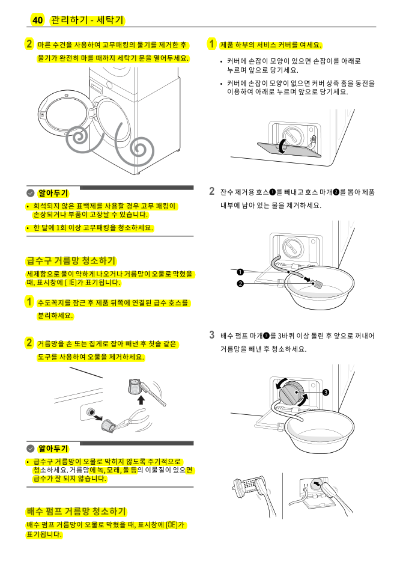

<b>검색됐지만 인용되지 않은 페이지 6개</b> (56쪽, 24쪽, 18쪽, 21쪽, 42쪽, 6쪽)

PDF 56쪽 · 형광펜 청크: `p56-c2`

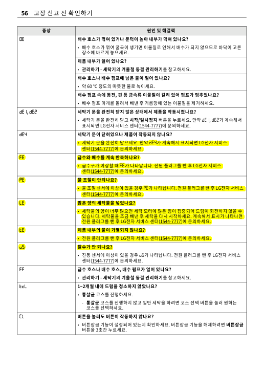

PDF 24쪽 · 형광펜 청크: `p24-c1`

PDF 18쪽 · 형광펜 청크: `p18-c2`, `p18-c1`

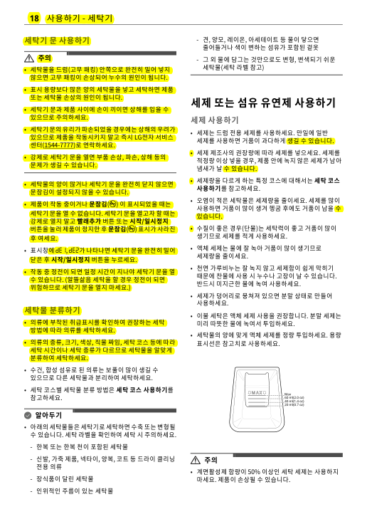

PDF 21쪽 · 형광펜 청크: `p21-c2`

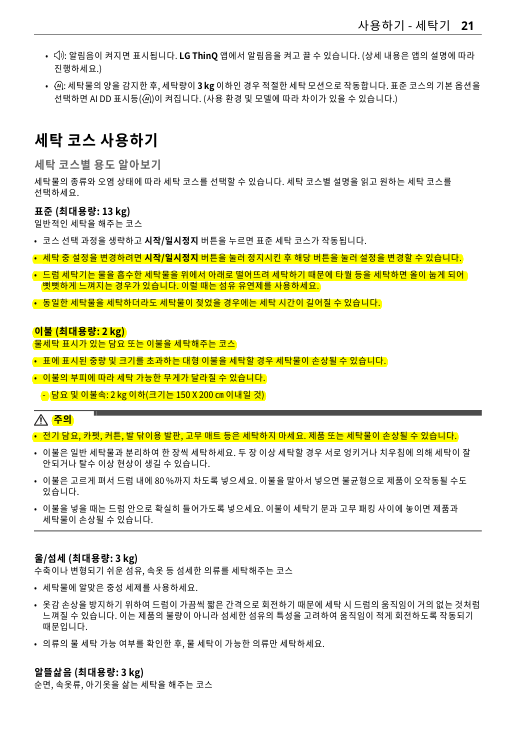

PDF 42쪽 · 형광펜 청크: `p42-c2`

PDF 6쪽 · 형광펜 청크: `p6-c3`

### Q06 · dE4가 떠요.

**답변** (판단: 서비스 기사 점검 권장)

> 판단: 서비스 기사 점검 권장
> 이유: 세탁기 문이 닫혀있으나 제품이 작동되지 않는 상태입니다.
>
> 세탁기 문을 완전히 닫으셨는지 확인해 주시고, 만약 dE4가 계속해서 표시된다면 LG전자 서비스 센터(1544-7777)에 문의하시기 바랍니다. [PDF 56쪽]

<b>검색된 Top-8 청크 원문</b>

| 순위 | 청크 | 페이지 | 유사도 | 답변 인용 | 본문 |
|---|---|---|---|---|---|
| 1 | `p56-c2` | 56쪽 | 0.416 | O | • 세탁기 문을 완전히 닫으세요. 만약 dE4가 계속해서 표시되면 LG전자 서비스 센터(1544-7777)에 문의하세요. FE 급수와 배수를 계속 반복하나요? • 급수구가 이상할 때 FE가 나타납니다. 전원 플러그를 뺀 후 LG전자 서비스 센터(1544-7777)에 문의하세요. PE 물 조절이 안되나요? • 물 조절 센서에 이상이 있을 경우 PE가 나타납니다. 전원 플러그를 뺀 후 LG전자 서비스 센터(1544-7777)에 문의하세요. LE 많은 양의 세탁물을 넣었나요? • 세탁물의 양이 너무 많으면 세탁 모터에 많은 힘이 집중되어 드럼이 회전하지 않을 수 있습니다. 세탁물을 조금 빼낸 후 세탁을 다시 시작하세요. 계속해서 표시가 나타나면 전원 플러그를 뺀 후 LG전자 서비스 센터(1544-7777 )에 문의하세요. tE 제품 내부의 물이 가열되지 않나요? • 전원 플러그를 뺀 후 LG전자 서비스 센터(1544-7777 )에 문의하세요. vs 탈수가 안 되나요? |
| 2 | `p56-c1` | 56쪽 | 0.318 | O | 56 고장 신고 전 확인하기 OE 배수 호스가 꺾여 있거나 문턱이 높아 내부가 막혀 있나요? • 배수 호스가 꺾여 굴곡이 생기면 이물질로 인해서 배수가 되지 않으므로 바닥이 고른 장소에 바르게 놓으세요. 제품 내부가 얼어 있나요? • 관리하기 - 세탁기 의 겨울철 동결 관리하기 를 참고하세요. 배수 호스나 배수 펌프에 남은 물이 얼어 있나요? • 약 60 ℃ 정도의 따뜻한 물로 녹이세요. 배수 펌프 속에 동전, 핀 등 금속류 이물질이 걸려 있어 펌프가 멈추었나요? • 배수 펌프 마개를 돌려서 빼낸 후 거름망에 있는 이물질을 제거하세요. dE1, dEz 세탁기 문을 완전히 닫지 않은 상태에서 제품을 작동시켰나요? • 세탁기 문을 완전히 닫고 시작/일시정지 버튼을 누르세요. 만약 dE1, dEz가 계속해서 표시되면 LG전자 서비스 센터(1544-7777 )에 문의하세요. dE4 세탁기 문이 닫혀있으나 제품이 작동되지 않나요? |
| 3 | `p43-c1` | 43쪽 | 0.281 | - | 43관리하기 - 세탁기 4 급수가 안 될 경우에는 아래와 같이 조치하세요. • 수도꼭지를 잠근 후 뜨거운 물수건으로 수도꼭지와 제품 급수 호스 양쪽 연결 부위를 녹이세요. • 급수 호스를 빼서 약 60 ℃ 정도의 따뜻한 물에 담그세요. |
| 4 | `p55-c2` | 55쪽 | 0.271 | - | • 이불을 크기에 상관없이 한 장씩 세탁하세요. 세탁물이 뭉쳐 있나요? • 시작/일시정지 버튼을 눌러 UE를 해제시킨 후 세탁물을 고르게 펴고 탈수를 선택하여 제품을 작동하세요. IE 급수 밸브가 잠겨 있나요? • 세탁기와 연결된 급수 밸브를 여세요. 단수되어 있나요? • 연결된 수도꼭지에 이상이 있으면 해당 수리 업체에 문의하세요. • 집 전체가 단수라면 시청이나 군청에 문의하세요. 수도꼭지나 급수 호스가 얼어 있나요? • 수도꼭지를 잠근 후 뜨거운 물수건으로 수도꼭지와 제품 급수 호스 양쪽 연결 부위를 녹이세요. 급수 호스가 막혀 있나요? • 급수구에서 거름망을 꺼내어 이물질을 제거하세요. 급수 호스가 꺾여 있나요? • 급수 호스가 꺾이지 않도록 펴세요. 급수 호스가 수도꼭지에 바르게 연결되어 있지 않나요? • 급수 호스가 수도꼭지에 밀착되도록 다시 조이세요. OE 배수 호스 끝이 지면으로부터 50 cm 이상의 높이에 설치되어 있나요? |
| 5 | `p40-c1` | 40쪽 | 0.262 | - | 40 관리하기 - 세탁기 2 마른 수건을 사용하여 고무패킹의 물기를 제거한 후 물기가 완전히 마를 때까지 세탁기 문을 열어두세요. 알아두기 • 희석되지 않은 표백제를 사용할 경우 고무 패킹이 손상되거나 부품이 고장날 수 있습니다. • 한 달에 1회 이상 고무패킹을 청소하세요. 급수구 거름망 청소하기 세제함으로 물이 약하게 나오거나 거름망이 오물로 막혔을 때, 표시창에 [ 1E]가 표기됩니다. 1 수도꼭지를 잠근 후 제품 뒤쪽에 연결된 급수 호스를 분리하세요. 2 거름망을 손 또는 집게로 잡아 빼낸 후 칫솔 같은 도구를 사용하여 오물을 제거하세요. 알아두기 • 급수구 거름망이 오물로 막히지 않도록 주기적으로 청 소 하 세 요. 거 름 망 에 녹, 모 래, 돌 등 의 이 물 질 이 있 으 면 급수가 잘 되지 않습니다. 배수 펌프 거름망 청소하기 배수 펌프 거름망이 오물로 막혔을 때, 표시창에 [ OE]가 표기됩니다. 1 제품 하부의 서비스 커버를 여세요. |
| 6 | `p57-c3` | 57쪽 | 0.239 | - | • 수도꼭지를 여세요. 사용 수압이 너무 낮은가요? • 급수구의 거름망을 청소하거나 수압을 확인하세요. 쾅쾅거리는 쇳소리가 나요. 제품이 급수 중인가요? • 급수 시 급수 배관 내의 압력차에 의해 물이 급수 배관을 두드리는 소리입니다. 제품 이상으로 발생하는 소리가 아닙니다. 전원이 들어오지 않아요. 전원 플러그가 콘센트에서 빠져 있나요? • 전원 플러그를 콘센트에 바르게 끼우고 전원 버튼을 누르세요. 누전 차단기가 OFF로 되어 있나요? • 누전 차단기를 ON으로 바꾸세요. 110 V 전원에 연결했나요? • 본 제품은 220 V 전용입니다. 220 V 전원에 연결하세요. 전원이 꺼져 있는데도 드럼을 손으로 회전시키면 전원이 켜져요. 전원이 자동으로 켜지나요? • 모터가 회전되어 발전기 역할을 하면 나타나는 정상 현상입니다. 전원이 켜졌다가 일정 시간(수 초에서 수 분)이 지나면 자동으로 꺼집니다. 증상 원인 및 해결책 |
| 7 | `p53-c1` | 53쪽 | 0.235 | - | 53설치하기 • 전면부의 부착이 어렵다면 후면부 좌측과 우측의 다리에 부착하세요. a 윗면(거친면) b 접착면 3 거친면 위에 제품을 설치하세요. 4 부착 중 제품의 수평 상태가 틀어질 수 있으니, 부착 후 반드시 제품의 수평 상태를 확인하세요. |
| 8 | `p55-c3` | 55쪽 | 0.234 | - | • 급수 호스가 수도꼭지에 밀착되도록 다시 조이세요. OE 배수 호스 끝이 지면으로부터 50 cm 이상의 높이에 설치되어 있나요? • 배수 호스 끝의 높이를 50 cm 이하로 설치하세요. 배수 호스가 올려져 있나요? • 배수 호스를 내려주세요. |

**답변이 인용한 페이지**

PDF 56쪽 · 형광펜 청크: `p56-c2`, `p56-c1`

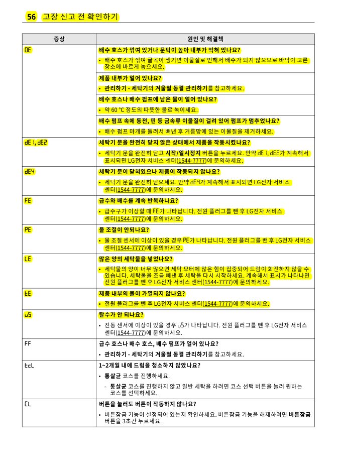

<b>검색됐지만 인용되지 않은 페이지 5개</b> (43쪽, 55쪽, 40쪽, 57쪽, 53쪽)

PDF 43쪽 · 형광펜 청크: `p43-c1`

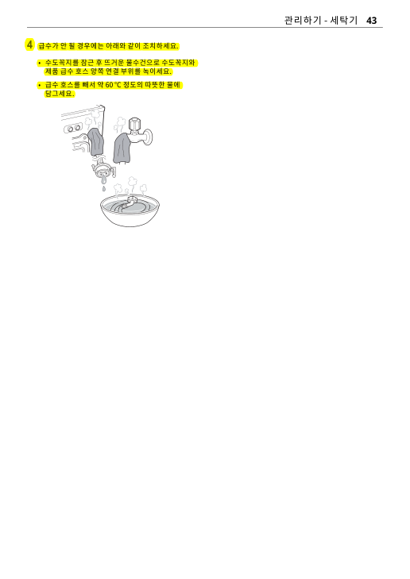

PDF 55쪽 · 형광펜 청크: `p55-c2`, `p55-c3`

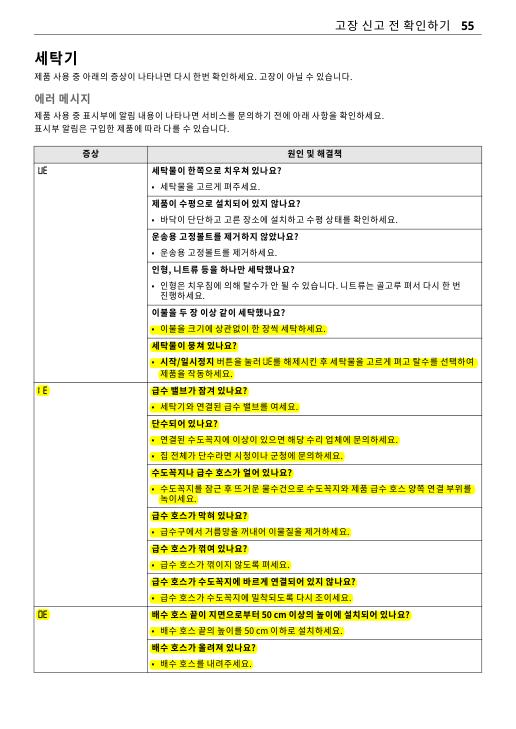

PDF 40쪽 · 형광펜 청크: `p40-c1`

PDF 57쪽 · 형광펜 청크: `p57-c3`

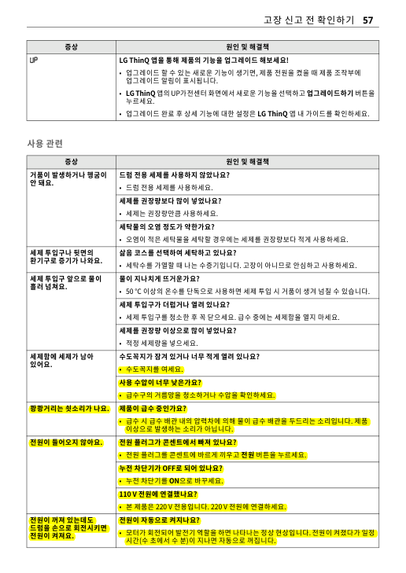

PDF 53쪽 · 형광펜 청크: `p53-c1`

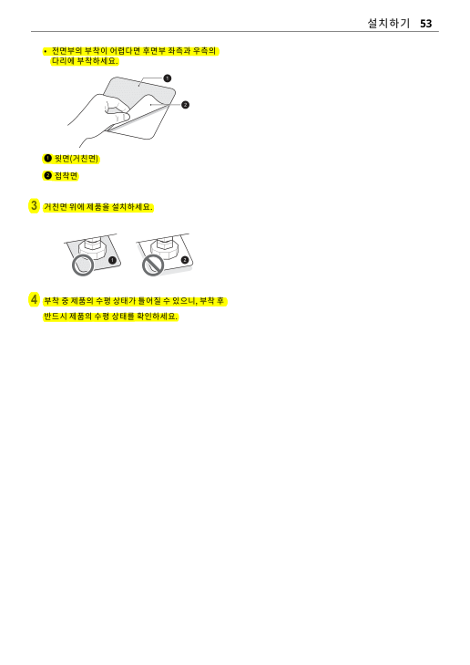

### Q07 · IE가 뜨는데 겨울이라 급수 호스가 얼었을 수도 있어요. 녹이는 방법이랑 거름망 청소 방법을 둘 다 알려주세요.

**답변** (판단: 자가 점검 우선)

> 판단: 자가 점검 우선
> 이유: IE 오류는 급수 호스가 얼었거나 거름망이 막혔을 가능성이 있습니다.
>
> 먼저, 급수 호스가 얼었는지 확인해보세요. 수도꼭지를 잠근 후, 급수 호스를 분리하고 약 60℃ 정도의 따뜻한 물에 담가서 녹이세요. 이 과정은 [PDF 43쪽]에 설명되어 있습니다. 거름망 청소는 다음과 같이 진행하세요: 1. 수도꼭지를 잠근 후 제품 뒤쪽에 연결된 급수 호스를 분리하세요. 2. 거름망을 손이나 집게로 잡아 빼낸 후 칫솔 같은 도구로 오물을 제거하세요. 이 절차는 [PDF 40쪽]에 나와 있습니다.

<b>검색된 Top-8 청크 원문</b>

| 순위 | 청크 | 페이지 | 유사도 | 답변 인용 | 본문 |
|---|---|---|---|---|---|
| 1 | `p43-c1` | 43쪽 | 0.483 | O | 43관리하기 - 세탁기 4 급수가 안 될 경우에는 아래와 같이 조치하세요. • 수도꼭지를 잠근 후 뜨거운 물수건으로 수도꼭지와 제품 급수 호스 양쪽 연결 부위를 녹이세요. • 급수 호스를 빼서 약 60 ℃ 정도의 따뜻한 물에 담그세요. |
| 2 | `p42-c2` | 42쪽 | 0.473 | - | • 과도한 거품이 생기는 세탁조 클리너는 누수가 발생할 수 있습니다. 세탁조 클리너의 사용량을 줄이거나,거품이 적게 생기는 세탁조 클리너 사용을 권장합니다. • 모델에 따라 드럼을 분해하여 청소하는 통세척 서비스 가 불가능한 경우가 있으니, 통세척 서비스 신청 전 LG전자 서비스 센터(1544-7777 )에 문의하세요. 겨울철 동결 해결하기 동결 확인 1 잔수 제거용 호스 a를 빼고 마개 b를 열었을 때 물이 나오지 않으면 배수부를 확인하세요. 2 전원을 켜고 소량급속 를 선택한 후 시작/일시정지 버튼을 누르세요. • 헹굼 시 세제함으로 물이 들어가는지, 탈수 시 배수 호스로 물이 빠지는지 반드시 확인하세요. 3 제품 동작 중 표시창에 [ FF]가 표시되면 급수부와 배수부를 확인하세요. 얼었을 경우에는 1 드럼에 세탁물이 있는지 확인한 후, 드럼이 비어있는 상태에서 내부의 고무 패킹까지 약 60 ℃ 정도의 따뜻한 물을 붓고 세탁기 문을 닫은 후 1~2시간을 기다리세요. 주의 |
| 3 | `p56-c1` | 56쪽 | 0.469 | - | 56 고장 신고 전 확인하기 OE 배수 호스가 꺾여 있거나 문턱이 높아 내부가 막혀 있나요? • 배수 호스가 꺾여 굴곡이 생기면 이물질로 인해서 배수가 되지 않으므로 바닥이 고른 장소에 바르게 놓으세요. 제품 내부가 얼어 있나요? • 관리하기 - 세탁기 의 겨울철 동결 관리하기 를 참고하세요. 배수 호스나 배수 펌프에 남은 물이 얼어 있나요? • 약 60 ℃ 정도의 따뜻한 물로 녹이세요. 배수 펌프 속에 동전, 핀 등 금속류 이물질이 걸려 있어 펌프가 멈추었나요? • 배수 펌프 마개를 돌려서 빼낸 후 거름망에 있는 이물질을 제거하세요. dE1, dEz 세탁기 문을 완전히 닫지 않은 상태에서 제품을 작동시켰나요? • 세탁기 문을 완전히 닫고 시작/일시정지 버튼을 누르세요. 만약 dE1, dEz가 계속해서 표시되면 LG전자 서비스 센터(1544-7777 )에 문의하세요. dE4 세탁기 문이 닫혀있으나 제품이 작동되지 않나요? |
| 4 | `p6-c3` | 6쪽 | 0.464 | - | • 세탁물을 제품 안에 넣기 전에 주머니에 있는 물건들은 모두 꺼내세요. - 라이터, 성냥, 동전, 머리핀, 열쇠 등 • 용제 성분 세제, 황화합물 표백제를 사용하지 말고 산소계 세탁 전용 세제 또는 표백제를 사용하세요. 제품 이상 및 고장이 발생했을 때 j 준수 사항 • 제품에서 이상한 소리나 냄새 또는 연기가 나면 즉시 전원 플러그를 뺀 후 LG전자 서비스 센터(1544-7777)로 연락하세요. • 겨울철에 배수 호스 또는 급수 호스가 얼었을 경우 녹인 후 사용하세요. |
| 5 | `p41-c1` | 41쪽 | 0.447 | - | 41관리하기 - 세탁기 4 청소가 끝나면 호스 마개와 배수 펌프 마개를 제자리에 조립하고 서비스 커버를 닫으세요. • 잔수 제거용 호스는 밀어 넣지 말고 제자리에 꽂으세요. • 배수 펌 프 마개 는 누 수가 발 생할 수 있 으므 로 조 립 시 주의하세요. 주의 • 배수 펌프 마개를 열기 전 드럼 안에 뜨거운 물이 있는지 먼저 확인하세요. 뜨거운 물이 쏟아져 화상을 입을 수 있습니다. • 호스 마개와 배수 펌프 마개를 정확하게 조립하지 않으면 누수의 원인이 됩니다. 제품 관리하기 통살균 사용하기 세탁기 내부에 발생된 균들을 살균하여 깨끗하고 청결함을 유지하기 위해 드럼을 청소하세요. 1 세탁조 클리너(세정제) 사용 시 제조사별 표준 사용량에 맞는 양을 세제 투입구에 넣으세요. (세탁 세제 및 섬유 유연제를 넣지 마세요. 거품이 많이 생기거나 살균 효과가 떨어질 수 있습니다.) 2 통살균 코스를 사용하여 드럼을 청소하세요. |
| 6 | `p40-c1` | 40쪽 | 0.447 | O | 40 관리하기 - 세탁기 2 마른 수건을 사용하여 고무패킹의 물기를 제거한 후 물기가 완전히 마를 때까지 세탁기 문을 열어두세요. 알아두기 • 희석되지 않은 표백제를 사용할 경우 고무 패킹이 손상되거나 부품이 고장날 수 있습니다. • 한 달에 1회 이상 고무패킹을 청소하세요. 급수구 거름망 청소하기 세제함으로 물이 약하게 나오거나 거름망이 오물로 막혔을 때, 표시창에 [ 1E]가 표기됩니다. 1 수도꼭지를 잠근 후 제품 뒤쪽에 연결된 급수 호스를 분리하세요. 2 거름망을 손 또는 집게로 잡아 빼낸 후 칫솔 같은 도구를 사용하여 오물을 제거하세요. 알아두기 • 급수구 거름망이 오물로 막히지 않도록 주기적으로 청 소 하 세 요. 거 름 망 에 녹, 모 래, 돌 등 의 이 물 질 이 있 으 면 급수가 잘 되지 않습니다. 배수 펌프 거름망 청소하기 배수 펌프 거름망이 오물로 막혔을 때, 표시창에 [ OE]가 표기됩니다. 1 제품 하부의 서비스 커버를 여세요. |
| 7 | `p42-c3` | 42쪽 | 0.440 | - | • 끓는 물을 사용하면 화상을 입을 수 있으니 주의하세요. 2 서비스 커버를 열고 잔수 제거용 호스 마개를 열어 물을 완전히 빼세요. • 물이 나오지 않으면 얼음이 다 녹지 않은 것이므로 기다리세요. 3 드럼에서 물이 다 빠지면 잔수 제거용 호스 마개를 닫은 후, 전원을 켜고 소량급속 를 선택한 후 시작/일시정지 버튼을 누르세요. • 헹굼 시 세제함으로 물이 들어가는지, 탈수 시 배수 호스로 물이 빠지는지 반드시 확인하세요. |
| 8 | `p8-c1` | 8쪽 | 0.430 | - | 8 안전을 위해 주의하기 j 준수 사항 • 제품 설치 및 운반 시에는 2명 이상이 안전하게 운반하여 설치하세요. • 제품 운송 후 뒷면의 운송용 고정볼트는 반드시 제거한 후 사용하세요. • 냉수 호스는 냉수 급수구, 온수 호스는 온수 급수구에 연결하세요. • 급수 호스를 연결한 후 수도꼭지를 열어 물이 새는지 확인하세요. • 제품과 함께 받은 새로운 급수 호스를 연결하세요. 낡은 호스는 누수 등의 원인이 될 수 있으므로 사용하지 마세요. 제품을 사용할 때 R 금지 사항 • 제품 밑에 손, 발 등의 신체 또는 금속 재질의 물건을 넣지 마세요. • 제품이 작동할 때 제품 문을 억지로 열지 마세요. • 배수되는 물은 뜨거울 수 있으므로 만지지 마세요. • 드럼 안에 물, 표백제, 액체 세제 등을 장시간 방치하지 마세요. |

**답변이 인용한 페이지**

PDF 40쪽 · 형광펜 청크: `p40-c1`

PDF 43쪽 · 형광펜 청크: `p43-c1`

<b>검색됐지만 인용되지 않은 페이지 5개</b> (42쪽, 56쪽, 6쪽, 41쪽, 8쪽)

PDF 42쪽 · 형광펜 청크: `p42-c2`, `p42-c3`

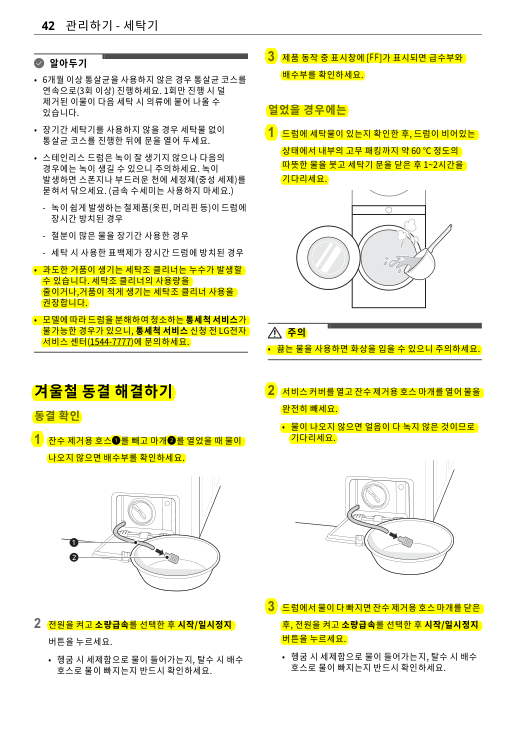

PDF 56쪽 · 형광펜 청크: `p56-c1`

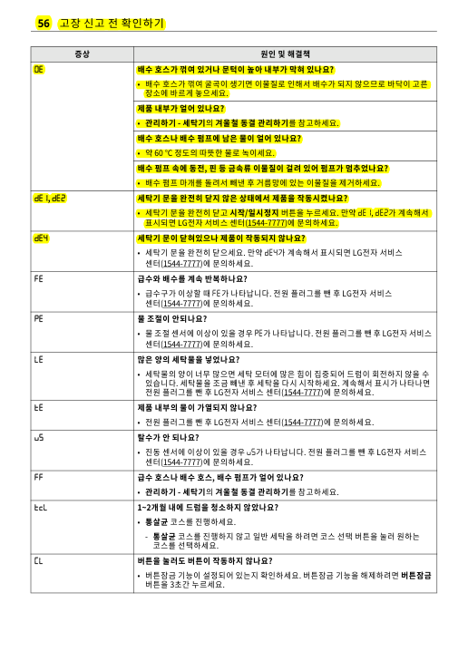

PDF 6쪽 · 형광펜 청크: `p6-c3`

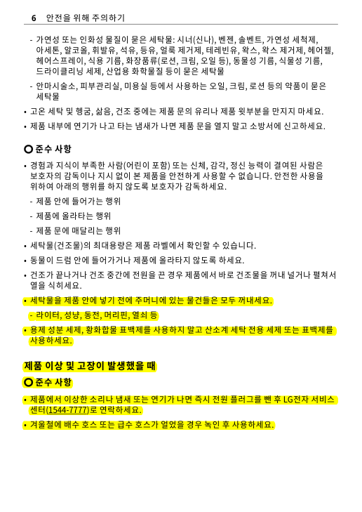

PDF 41쪽 · 형광펜 청크: `p41-c1`

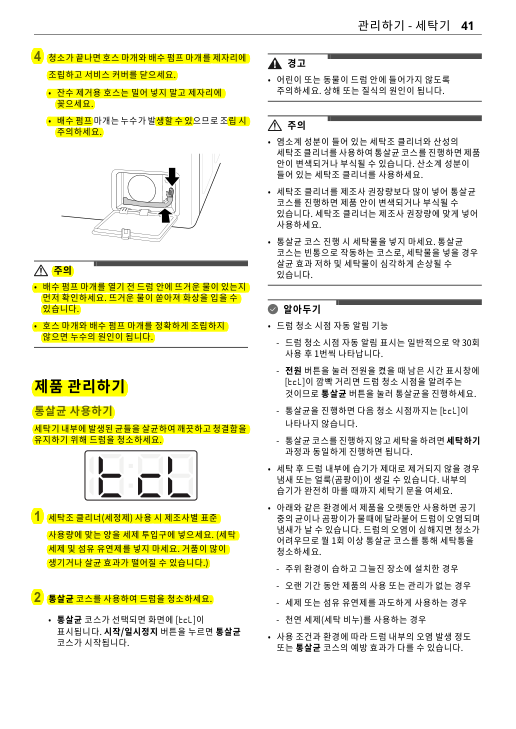

PDF 8쪽 · 형광펜 청크: `p8-c1`

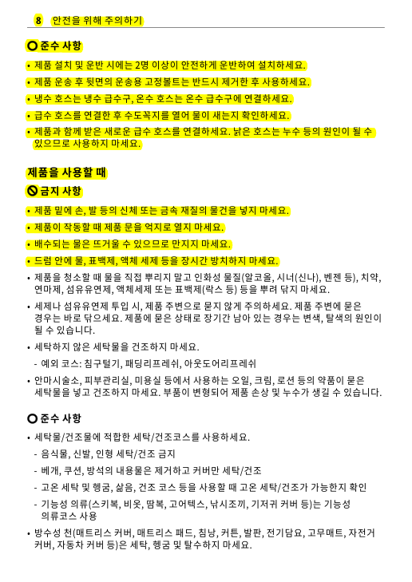

### Q08 · UE가 떠서 이불을 한 장씩 나눠 빨았는데, 이번에는 빨래에서 냄새가 나요. 두 가지 다 어떻게 해야 하나요?

**답변** (판단: 자가 점검 우선)

> 판단: 자가 점검 우선
> 이유: 세탁물의 양을 줄였음에도 불구하고 UE가 발생하고, 세탁물에서 냄새가 나는 것은 세탁물의 불균형과 드럼 내부의 습기 문제로 보입니다.
>
> 세탁물이 고르게 분포되어 있는지 확인해 보세요. 또한, 세탁 완료 후에는 세탁물을 즉시 꺼내고, 드럼 내부의 습기를 제거하기 위해 세탁기 문을 열어 두는 것이 좋습니다. 이와 관련된 내용은 [PDF 58쪽]에서 확인하실 수 있습니다.

<b>검색된 Top-8 청크 원문</b>

| 순위 | 청크 | 페이지 | 유사도 | 답변 인용 | 본문 |
|---|---|---|---|---|---|
| 1 | `p58-c4` | 58쪽 | 0.468 | O | • 세탁 완료 후 젖은 세탁물을 세탁통 내에 장시간 방치하면 세탁물에서 냄새가 날 수 있습니다. 세탁이 끝나고 바로 세탁물을 꺼내세요. • 세탁 완료 후 세탁통 내부에 습기가 제대로 제거되지 않을 경우 냄새 또는 얼룩(곰팡이)이 생길 수 있습니다. 내부의 습기가 완전히 마를 때까지 세탁기 문을 열어 두세요. 남은 시간 표시가 변경되었어요. 세탁물이 불균형하게 있거나 드럼에 거품이 많나요? • 세탁물을 고르게 펴주세요. • 수온, 수압, 주위 온도(계절) 등의 환경에 따라 급수 시간이 길어지거나 세탁 온도가 낮아져 시간이 달라질 수 있습니다. 증상 원인 및 해결책 |
| 2 | `p41-c4` | 41쪽 | 0.441 | - | • 세탁 후 드럼 내부에 습기가 제대로 제거되지 않을 경우 냄새 또는 얼룩(곰팡이)이 생길 수 있습니다. 내부의 습기가 완전히 마를 때까지 세탁기 문을 여세요. • 아래와 같은 환경에서 제품을 오랫동안 사용하면 공기 중의 균이나 곰팡이가 물때에 달라붙어 드럼이 오염되며 냄새가 날 수 있습니다. 드럼의 오염이 심해지면 청소가 어려우므로 월 1회 이상 통살균 코스를 통해 세탁통을 청소하세요. - 주위 환경이 습하고 그늘진 장소에 설치한 경우 - 오랜 기간 동안 제품의 사용 또는 관리가 없는 경우 - 세제 또는 섬유 유연제를 과도하게 사용하는 경우 - 천연 세제(세탁 비누)를 사용하는 경우 • 사용 조건과 환경에 따라 드럼 내부의 오염 발생 정도 또는 통살균 코스의 예방 효과가 다를 수 있습니다. |
| 3 | `p58-c3` | 58쪽 | 0.428 | O | • 고무 패킹을 주기적으로 청소하지 않을 경우 곰팡이나 이물질이 고무 패킹 안쪽에 남아 냄새가 날 수 있습니다. 고무 패킹을 주기적으로 청소하세요. • 배수 펌프 거름망에 이물질이 남아 있으면 냄새가 날 수 있습니다. 배수 펌프 거름망을 주기적으로 청소하세요. • 배수 호스가 올바르게 설치되어 있지 않으면 세탁기 내부로 물이 역류하여 냄새가 날 수 있습니다. 배수 호스가 꺾이거나 막히지 않도록 재설치하세요. • 적정량의 드럼 전용 세제를 넣어 사용하세요. 그렇지 않을 경우, 세탁기 안에 녹지 않은 세제가 남아 냄새의 원인이 될 수 있습니다. • 세탁 완료 후 젖은 세탁물을 세탁통 내에 장시간 방치하면 세탁물에서 냄새가 날 수 있습니다. 세탁이 끝나고 바로 세탁물을 꺼내세요. |
| 4 | `p58-c2` | 58쪽 | 0.404 | O | • 수평 조정 다리를 조절해 수평을 맞추세요. 터보샷 동작 또는 배수할 때 소리가 나나요? • 세탁 중에 '웅~'하는 소리는 터보샷 동작을 위한 순환펌프가 동작하는 소음입니다. • 배수 중에 '웅~'하는 소리는 배수를 위한 배수펌프가 동작하는 소음입니다. 문이 잘 안 닫힙니다. 건조기와 세탁기 문을 여닫는 느낌이 다르나요? • 세탁기는 물을 사용하기 때문에 누수 방지를 위해 고무 패킹이 문과 강하게 밀착되어 있습니다. 고무 패킹에 의해 문을 여닫는 느낌이 건조기와 다를 수 있습니다. 제품에서 이상한 냄새가 나요. 제품을 처음 사용했나요? • 세탁기 문에 부착된 고무로 인한 냄새입니다. 제품을 몇 번 사용하면 자연스럽게 사라집니다. 사용 중에 제품에서 냄새가 나나요? • 고무 패킹을 주기적으로 청소하지 않을 경우 곰팡이나 이물질이 고무 패킹 안쪽에 남아 냄새가 날 수 있습니다. 고무 패킹을 주기적으로 청소하세요. |
| 5 | `p6-c3` | 6쪽 | 0.400 | - | • 세탁물을 제품 안에 넣기 전에 주머니에 있는 물건들은 모두 꺼내세요. - 라이터, 성냥, 동전, 머리핀, 열쇠 등 • 용제 성분 세제, 황화합물 표백제를 사용하지 말고 산소계 세탁 전용 세제 또는 표백제를 사용하세요. 제품 이상 및 고장이 발생했을 때 j 준수 사항 • 제품에서 이상한 소리나 냄새 또는 연기가 나면 즉시 전원 플러그를 뺀 후 LG전자 서비스 센터(1544-7777)로 연락하세요. • 겨울철에 배수 호스 또는 급수 호스가 얼었을 경우 녹인 후 사용하세요. |
| 6 | `p24-c3` | 24쪽 | 0.386 | - | • 드럼이 회전 중인 경우 드럼이 정지하고 나서 문잠김이 해제됩니다. • 드럼 내 물의 온도가 높은 경우 온도가 내려갈 때까지 기다리세요. • 세탁기 히터가 작동하는 과정에서 문을 열면, 내부의 수증기가 빠져나올 수 있습니다. 이는 제품의 이상이 아닌 정상적인 현상이므로 안심하고 사용하세요. • 세제와 표백제를 동시에 투입할 경우, 냄새나 연기가 발생할 수 있습니다. 옵션 용도 |
| 7 | `p40-c1` | 40쪽 | 0.385 | - | 40 관리하기 - 세탁기 2 마른 수건을 사용하여 고무패킹의 물기를 제거한 후 물기가 완전히 마를 때까지 세탁기 문을 열어두세요. 알아두기 • 희석되지 않은 표백제를 사용할 경우 고무 패킹이 손상되거나 부품이 고장날 수 있습니다. • 한 달에 1회 이상 고무패킹을 청소하세요. 급수구 거름망 청소하기 세제함으로 물이 약하게 나오거나 거름망이 오물로 막혔을 때, 표시창에 [ 1E]가 표기됩니다. 1 수도꼭지를 잠근 후 제품 뒤쪽에 연결된 급수 호스를 분리하세요. 2 거름망을 손 또는 집게로 잡아 빼낸 후 칫솔 같은 도구를 사용하여 오물을 제거하세요. 알아두기 • 급수구 거름망이 오물로 막히지 않도록 주기적으로 청 소 하 세 요. 거 름 망 에 녹, 모 래, 돌 등 의 이 물 질 이 있 으 면 급수가 잘 되지 않습니다. 배수 펌프 거름망 청소하기 배수 펌프 거름망이 오물로 막혔을 때, 표시창에 [ OE]가 표기됩니다. 1 제품 하부의 서비스 커버를 여세요. |
| 8 | `p56-c2` | 56쪽 | 0.382 | - | • 세탁기 문을 완전히 닫으세요. 만약 dE4가 계속해서 표시되면 LG전자 서비스 센터(1544-7777)에 문의하세요. FE 급수와 배수를 계속 반복하나요? • 급수구가 이상할 때 FE가 나타납니다. 전원 플러그를 뺀 후 LG전자 서비스 센터(1544-7777)에 문의하세요. PE 물 조절이 안되나요? • 물 조절 센서에 이상이 있을 경우 PE가 나타납니다. 전원 플러그를 뺀 후 LG전자 서비스 센터(1544-7777)에 문의하세요. LE 많은 양의 세탁물을 넣었나요? • 세탁물의 양이 너무 많으면 세탁 모터에 많은 힘이 집중되어 드럼이 회전하지 않을 수 있습니다. 세탁물을 조금 빼낸 후 세탁을 다시 시작하세요. 계속해서 표시가 나타나면 전원 플러그를 뺀 후 LG전자 서비스 센터(1544-7777 )에 문의하세요. tE 제품 내부의 물이 가열되지 않나요? • 전원 플러그를 뺀 후 LG전자 서비스 센터(1544-7777 )에 문의하세요. vs 탈수가 안 되나요? |

**답변이 인용한 페이지**

PDF 58쪽 · 형광펜 청크: `p58-c4`, `p58-c3`, `p58-c2`

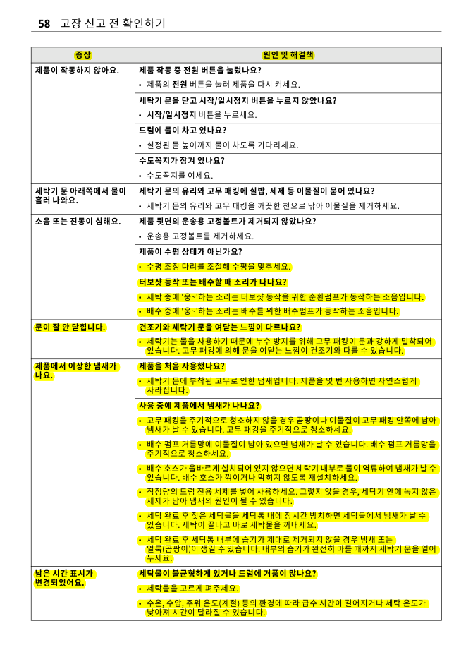

<b>검색됐지만 인용되지 않은 페이지 5개</b> (41쪽, 6쪽, 24쪽, 40쪽, 56쪽)

PDF 41쪽 · 형광펜 청크: `p41-c4`

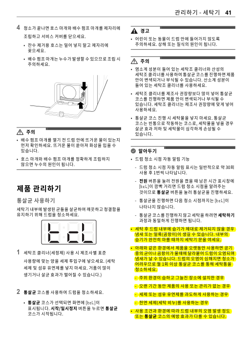

PDF 6쪽 · 형광펜 청크: `p6-c3`

PDF 24쪽 · 형광펜 청크: `p24-c3`

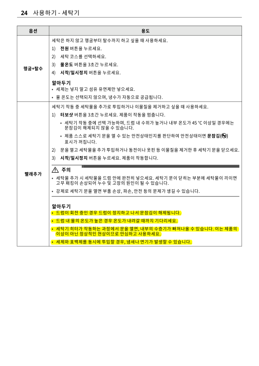

PDF 40쪽 · 형광펜 청크: `p40-c1`

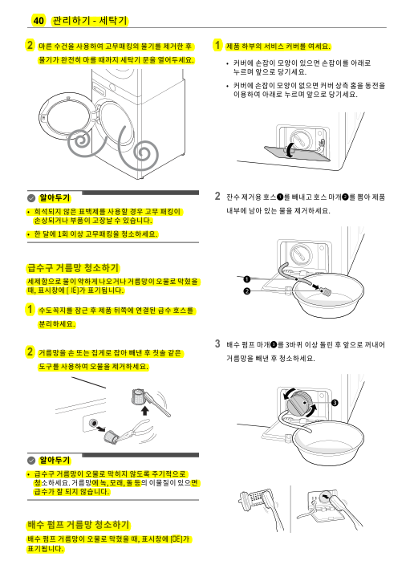

PDF 56쪽 · 형광펜 청크: `p56-c2`

### Q09 · 세탁기 무상 보증기간이 몇 년인가요?

**답변** (판단: 서비스 기사 점검 권장)

> 판단: 서비스 기사 점검 권장
> 이유: 고객님께서 문의하신 내용은 매뉴얼에 포함되어 있지 않아 확인할 수 없습니다.
>
> 무상 보증기간에 대한 정확한 정보는 LG전자 고객센터(1544-7777)로 문의하시기 바랍니다.

<b>검색된 Top-8 청크 원문</b>

| 순위 | 청크 | 페이지 | 유사도 | 답변 인용 | 본문 |
|---|---|---|---|---|---|
| 1 | `p42-c1` | 42쪽 | 0.462 | - | 42 관리하기 - 세탁기 알아두기 • 6개월 이상 통살균을 사용하지 않은 경우 통살균 코스를 연속으로(3회 이상) 진행하세요. 1회만 진행 시 덜 제거된 이물이 다음 세탁 시 의류에 붙어 나올 수 있습니다. • 장기간 세탁기를 사용하지 않을 경우 세탁물 없이 통살균 코스를 진행한 뒤에 문을 열어 두세요. • 스테인리스 드럼은 녹이 잘 생기지 않으나 다음의 경우에는 녹이 생길 수 있으니 주의하세요. 녹이 발생하면 스폰지나 부드러운 천에 세정제(중성 세제)를 묻혀서 닦으세요. (금속 수세미는 사용하지 마세요.) - 녹이 쉽게 발생하는 철제품(옷핀, 머리핀 등)이 드럼에 장시간 방치된 경우 - 철분이 많은 물을 장기간 사용한 경우 - 세탁 시 사용한 표백제가 장시간 드럼에 방치된 경우 • 과도한 거품이 생기는 세탁조 클리너는 누수가 발생할 수 있습니다. 세탁조 클리너의 사용량을 줄이거나,거품이 적게 생기는 세탁조 클리너 사용을 권장합니다. |
| 2 | `p19-c1` | 19쪽 | 0.439 | - | 19사용하기 - 세탁기 • 세탁 시 재생비누를 사용하지 마세요. 재생비누의 성분들이 세탁기 내부에 쌓여서 계속 사용하면 오염이 생길 수 있습니다. • 건조기용 오일, 아로마 오일 등 각종 오일류를 세제함(세제 또는 유연제)에 넣지 마세요. 알아두기 • 애벌 세탁 옵션 설정 시, 가루 세제 사용을 권장합니다. 액체 세제를 사용하면 세탁 전에 세제가 흘러 들어갈 수 있습니다. • 속옷(면)이나 아기의 옷(면)에 묻은 오염은 피지(지방류)나 단백질 성분이 대부분이므로 세제를 많이 사용하는 것보다 다소 높은 온도에서 세탁한 후 헹굼 횟수를 늘리는 것이 효과적입니다. • 급수 시간이 짧으므로 세탁 시작 전에 미리 세제를 넣으세요. • 가루 세제 사용 시, 세제함이 젖어 있으면 세제가 세제함에 남을 수 있으니 사용 전 물기를 제거하세요. |
| 3 | `p40-c1` | 40쪽 | 0.439 | - | 40 관리하기 - 세탁기 2 마른 수건을 사용하여 고무패킹의 물기를 제거한 후 물기가 완전히 마를 때까지 세탁기 문을 열어두세요. 알아두기 • 희석되지 않은 표백제를 사용할 경우 고무 패킹이 손상되거나 부품이 고장날 수 있습니다. • 한 달에 1회 이상 고무패킹을 청소하세요. 급수구 거름망 청소하기 세제함으로 물이 약하게 나오거나 거름망이 오물로 막혔을 때, 표시창에 [ 1E]가 표기됩니다. 1 수도꼭지를 잠근 후 제품 뒤쪽에 연결된 급수 호스를 분리하세요. 2 거름망을 손 또는 집게로 잡아 빼낸 후 칫솔 같은 도구를 사용하여 오물을 제거하세요. 알아두기 • 급수구 거름망이 오물로 막히지 않도록 주기적으로 청 소 하 세 요. 거 름 망 에 녹, 모 래, 돌 등 의 이 물 질 이 있 으 면 급수가 잘 되지 않습니다. 배수 펌프 거름망 청소하기 배수 펌프 거름망이 오물로 막혔을 때, 표시창에 [ OE]가 표기됩니다. 1 제품 하부의 서비스 커버를 여세요. |
| 4 | `p39-c1` | 39쪽 | 0.429 | - | 39관리하기 - 세탁기 관리하기 - 세탁기 제품 청소하기 외부 청소하기 • 제품은 부드러운 수건에 물을 적셔 닦고, 중성 세제를 사용한 경우 얼룩이 발생하지 않도록 깨끗한 물수건으로 닦으세요. • 제품 외부의 유리 도어에 생긴 가벼운 얼룩은 마른 천을 사용하여 닦으세요. 쉽게 지워지지 않는 얼룩은 미지근한 물이나 유리 세정제를 묻힌 천으로 닦으세요. 세제함 청소하기 a분리(PUSH) 버튼을 누른 상태로 b세제함을 앞으로 당겨 빼세요. • 칫솔 같은 도구를 사용하여 세제함과 세제함이 들어가는 내부를 깨끗이 청소하세요. 경고 • 제품 내부에 직접 물을 뿌려 청소하지 마세요. 화재 또는 감전의 원인이 됩니다. 알아두기 • 세제함을 1주일에 1회 정도 청소하면 더욱 청결하게 세탁할 수 있습니다. 물 분사 노즐 청소하기 세탁기 문을 열어 고무 패킹의 안에 있는 물 분사 노즐에서 이물질을 제거하세요. |
| 5 | `p18-c1` | 18쪽 | 0.416 | - | 18 사용하기 - 세탁기 세탁기 문 사용하기 주의 • 세탁물을 드럼(고무 패킹) 안쪽으로 완전히 밀어 넣지 않으면 고무 패킹이 손상되어 누수의 원인이 됩니다. • 표시 용량보다 많은 양의 세탁물을 넣고 세탁하면 제품 또는 세탁물 손상의 원인이 됩니다. • 세탁기 문과 제품 사이에 손이 끼이면 상해를 입을 수 있으므로 주의하세요. • 세탁기 문의 유리가 파손되었을 경우에는 상해의 우려가 있으므로 제품을 작동시키지 말고 즉시 LG전자 서비스 센터(1544-7777)로 연락하세요. • 강제로 세탁기 문을 열면 부품 손상, 파손, 상해 등의 문제가 생길 수 있습니다. • 세탁물의 양이 많거나 세탁기 문을 완전히 닫지 않으면 문잠김이 설정되지 않을 수 있습니다. |
| 6 | `p21-c2` | 21쪽 | 0.414 | - | • 세탁 중 설정을 변경하려면 시작/일시정지 버튼을 눌러 정지시킨 후 해당 버튼을 눌러 설정을 변경할 수 있습니다. • 드럼 세탁기는 물을 흡수한 세탁물을 위에서 아래로 떨어뜨려 세탁하기 때문에 타월 등을 세탁하면 올이 눕게 되어 뻣뻣하게 느껴지는 경우가 있습니다. 이럴 때는 섬유 유연제를 사용하세요. • 동일한 세탁물을 세탁하더라도 세탁물이 젖었을 경우에는 세탁 시간이 길어질 수 있습니다. 이불 (최대용량: 2 kg) 물세탁 표시가 있는 담요 또는 이불을 세탁해주는 코스 • 표에 표시된 중량 및 크기를 초과하는 대형 이불을 세탁할 경우 세탁물이 손상될 수 있습니다. • 이불의 부피에 따라 세탁 가능한 무게가 달라질 수 있습니다. - 담요 및 이불속: 2 kg 이하(크기는 150 X 200 ㎝ 이내일 것) 주의 • 전기 담요, 카펫, 커튼, 발 닦이용 발판, 고무 매트 등은 세탁하지 마세요. 제품 또는 세탁물이 손상될 수 있 습니다. |
| 7 | `p6-c3` | 6쪽 | 0.411 | - | • 세탁물을 제품 안에 넣기 전에 주머니에 있는 물건들은 모두 꺼내세요. - 라이터, 성냥, 동전, 머리핀, 열쇠 등 • 용제 성분 세제, 황화합물 표백제를 사용하지 말고 산소계 세탁 전용 세제 또는 표백제를 사용하세요. 제품 이상 및 고장이 발생했을 때 j 준수 사항 • 제품에서 이상한 소리나 냄새 또는 연기가 나면 즉시 전원 플러그를 뺀 후 LG전자 서비스 센터(1544-7777)로 연락하세요. • 겨울철에 배수 호스 또는 급수 호스가 얼었을 경우 녹인 후 사용하세요. |
| 8 | `p24-c1` | 24쪽 | 0.408 | - | 24 사용하기 - 세탁기 헹굼+탈수 세탁은 하지 않고 헹굼부터 탈수까지 하고 싶을 때 사용하세요. 1) 전원 버튼을 누르세요. 2) 세탁 코스를 선택하세요. 3) 물온도 버튼을 3초간 누르세요. 4) 시작/일시정지 버튼을 누르세요. 알아두기 • 세제는 넣지 말고 섬유 유연제만 넣으세요. • 물 온도는 선택되지 않으며, 냉수가 자동으로 공급됩니다. 빨래추가 세탁기 작동 중 세탁물을 추가로 투입하거나 이물질을 제거하고 싶을 때 사용하세요. 1) 터보샷 버튼을 3초간 누르세요. 제품이 작동을 멈춥니다. • 세탁기 작동 중에 선택 가능하며, 드럼 내 수위가 높거나 내부 온도가 45 ℃ 이상일 경우에는 문잠김이 해제되지 않을 수 있습니다. |

**답변이 인용한 페이지**: 없음 (문서에 없는 질문)

<b>검색됐지만 인용되지 않은 페이지 8개</b> (42쪽, 19쪽, 40쪽, 39쪽, 18쪽, 21쪽, 6쪽, 24쪽)

PDF 42쪽 · 형광펜 청크: `p42-c1`

PDF 19쪽 · 형광펜 청크: `p19-c1`

PDF 40쪽 · 형광펜 청크: `p40-c1`

PDF 39쪽 · 형광펜 청크: `p39-c1`

PDF 18쪽 · 형광펜 청크: `p18-c1`

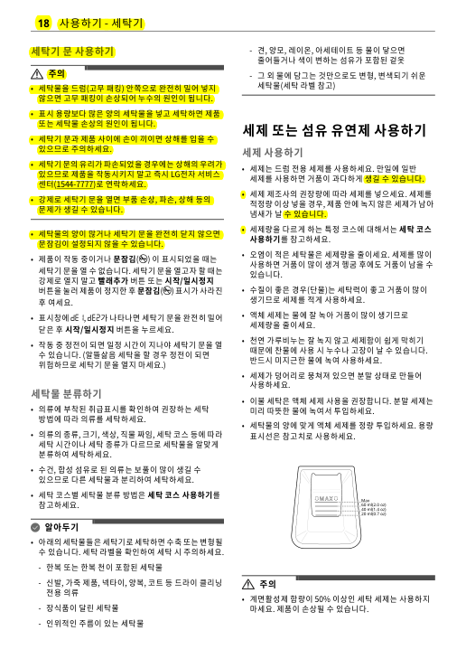

PDF 21쪽 · 형광펜 청크: `p21-c2`

PDF 6쪽 · 형광펜 청크: `p6-c3`

PDF 24쪽 · 형광펜 청크: `p24-c1`

### Q10 · 세탁기 수리 기사님 출장비는 얼마인가요?

**답변** (판단: 서비스 기사 점검 권장)

> 판단: 서비스 기사 점검 권장
> 이유: 세탁기 수리 출장비는 매뉴얼에 포함된 정보가 아닙니다.
>
> 정확한 출장비는 LG전자 고객센터(1544-7777)에 문의하셔야 합니다.

<b>검색된 Top-8 청크 원문</b>

| 순위 | 청크 | 페이지 | 유사도 | 답변 인용 | 본문 |
|---|---|---|---|---|---|
| 1 | `p6-c3` | 6쪽 | 0.424 | - | • 세탁물을 제품 안에 넣기 전에 주머니에 있는 물건들은 모두 꺼내세요. - 라이터, 성냥, 동전, 머리핀, 열쇠 등 • 용제 성분 세제, 황화합물 표백제를 사용하지 말고 산소계 세탁 전용 세제 또는 표백제를 사용하세요. 제품 이상 및 고장이 발생했을 때 j 준수 사항 • 제품에서 이상한 소리나 냄새 또는 연기가 나면 즉시 전원 플러그를 뺀 후 LG전자 서비스 센터(1544-7777)로 연락하세요. • 겨울철에 배수 호스 또는 급수 호스가 얼었을 경우 녹인 후 사용하세요. |
| 2 | `p24-c1` | 24쪽 | 0.407 | - | 24 사용하기 - 세탁기 헹굼+탈수 세탁은 하지 않고 헹굼부터 탈수까지 하고 싶을 때 사용하세요. 1) 전원 버튼을 누르세요. 2) 세탁 코스를 선택하세요. 3) 물온도 버튼을 3초간 누르세요. 4) 시작/일시정지 버튼을 누르세요. 알아두기 • 세제는 넣지 말고 섬유 유연제만 넣으세요. • 물 온도는 선택되지 않으며, 냉수가 자동으로 공급됩니다. 빨래추가 세탁기 작동 중 세탁물을 추가로 투입하거나 이물질을 제거하고 싶을 때 사용하세요. 1) 터보샷 버튼을 3초간 누르세요. 제품이 작동을 멈춥니다. • 세탁기 작동 중에 선택 가능하며, 드럼 내 수위가 높거나 내부 온도가 45 ℃ 이상일 경우에는 문잠김이 해제되지 않을 수 있습니다. |
| 3 | `p39-c1` | 39쪽 | 0.397 | - | 39관리하기 - 세탁기 관리하기 - 세탁기 제품 청소하기 외부 청소하기 • 제품은 부드러운 수건에 물을 적셔 닦고, 중성 세제를 사용한 경우 얼룩이 발생하지 않도록 깨끗한 물수건으로 닦으세요. • 제품 외부의 유리 도어에 생긴 가벼운 얼룩은 마른 천을 사용하여 닦으세요. 쉽게 지워지지 않는 얼룩은 미지근한 물이나 유리 세정제를 묻힌 천으로 닦으세요. 세제함 청소하기 a분리(PUSH) 버튼을 누른 상태로 b세제함을 앞으로 당겨 빼세요. • 칫솔 같은 도구를 사용하여 세제함과 세제함이 들어가는 내부를 깨끗이 청소하세요. 경고 • 제품 내부에 직접 물을 뿌려 청소하지 마세요. 화재 또는 감전의 원인이 됩니다. 알아두기 • 세제함을 1주일에 1회 정도 청소하면 더욱 청결하게 세탁할 수 있습니다. 물 분사 노즐 청소하기 세탁기 문을 열어 고무 패킹의 안에 있는 물 분사 노즐에서 이물질을 제거하세요. |
| 4 | `p19-c1` | 19쪽 | 0.388 | - | 19사용하기 - 세탁기 • 세탁 시 재생비누를 사용하지 마세요. 재생비누의 성분들이 세탁기 내부에 쌓여서 계속 사용하면 오염이 생길 수 있습니다. • 건조기용 오일, 아로마 오일 등 각종 오일류를 세제함(세제 또는 유연제)에 넣지 마세요. 알아두기 • 애벌 세탁 옵션 설정 시, 가루 세제 사용을 권장합니다. 액체 세제를 사용하면 세탁 전에 세제가 흘러 들어갈 수 있습니다. • 속옷(면)이나 아기의 옷(면)에 묻은 오염은 피지(지방류)나 단백질 성분이 대부분이므로 세제를 많이 사용하는 것보다 다소 높은 온도에서 세탁한 후 헹굼 횟수를 늘리는 것이 효과적입니다. • 급수 시간이 짧으므로 세탁 시작 전에 미리 세제를 넣으세요. • 가루 세제 사용 시, 세제함이 젖어 있으면 세제가 세제함에 남을 수 있으니 사용 전 물기를 제거하세요. |
| 5 | `p14-c1` | 14쪽 | 0.388 | - | 14 알아보기 알아보기 워시타워의 모습 살펴보기 제품이나 구성품의 모습은 구매하신 모델에 따라 달라질 수 있습니다. 제품 앞면 a 기능조작부 b 필터 c 건조기 드럼 d 건조기 문 (도어) e 세제함 f 세탁기 문 (도어) g 세탁기 드럼 h 잔수 제거용 호스 i 배수 펌프 마개 j 서비스 커버 k 수평 조정 다리 제품 뒷면 a 세탁기 급수구 b 운송용 고정볼트 c 배수호스 건조기 전용 구성품 *1 이 구성품은 일부 모델에 한하여 제공됩니다. a 건조기용 건조 선반 *1 b 건조기용 섬유 유연시트 (10매) c 환기용 도어 클립 |
| 6 | `p56-c2` | 56쪽 | 0.387 | - | • 세탁기 문을 완전히 닫으세요. 만약 dE4가 계속해서 표시되면 LG전자 서비스 센터(1544-7777)에 문의하세요. FE 급수와 배수를 계속 반복하나요? • 급수구가 이상할 때 FE가 나타납니다. 전원 플러그를 뺀 후 LG전자 서비스 센터(1544-7777)에 문의하세요. PE 물 조절이 안되나요? • 물 조절 센서에 이상이 있을 경우 PE가 나타납니다. 전원 플러그를 뺀 후 LG전자 서비스 센터(1544-7777)에 문의하세요. LE 많은 양의 세탁물을 넣었나요? • 세탁물의 양이 너무 많으면 세탁 모터에 많은 힘이 집중되어 드럼이 회전하지 않을 수 있습니다. 세탁물을 조금 빼낸 후 세탁을 다시 시작하세요. 계속해서 표시가 나타나면 전원 플러그를 뺀 후 LG전자 서비스 센터(1544-7777 )에 문의하세요. tE 제품 내부의 물이 가열되지 않나요? • 전원 플러그를 뺀 후 LG전자 서비스 센터(1544-7777 )에 문의하세요. vs 탈수가 안 되나요? |
| 7 | `p55-c1` | 55쪽 | 0.386 | - | 55고장 신고 전 확인하기 세탁기 제품 사용 중 아래의 증상이 나타나면 다시 한번 확인하세요. 고장이 아닐 수 있습니다. 에러 메시지 제품 사용 중 표시부에 알림 내용이 나타나면 서비스를 문의하기 전에 아래 사항을 확인하세요. 표시부 알림은 구입한 제품에 따라 다를 수 있습니다. 증상 원인 및 해결책 UE 세탁물이 한쪽으로 치우쳐 있나요? • 세탁물을 고르게 펴주세요. 제품이 수평으로 설치되어 있지 않나요? • 바닥이 단단하고 고른 장소에 설치하고 수평 상태를 확인하세요. 운송용 고정볼트를 제거하지 않았나요? • 운송용 고정볼트를 제거하세요. 인형, 니트류 등을 하나만 세탁했나요? • 인형은 치우침에 의해 탈수가 안 될 수 있습니다. 니트류는 골고루 펴서 다시 한 번 진행하세요. 이불을 두 장 이상 같이 세탁했나요? • 이불을 크기에 상관없이 한 장씩 세탁하세요. 세탁물이 뭉쳐 있나요? |
| 8 | `p42-c2` | 42쪽 | 0.381 | - | • 과도한 거품이 생기는 세탁조 클리너는 누수가 발생할 수 있습니다. 세탁조 클리너의 사용량을 줄이거나,거품이 적게 생기는 세탁조 클리너 사용을 권장합니다. • 모델에 따라 드럼을 분해하여 청소하는 통세척 서비스 가 불가능한 경우가 있으니, 통세척 서비스 신청 전 LG전자 서비스 센터(1544-7777 )에 문의하세요. 겨울철 동결 해결하기 동결 확인 1 잔수 제거용 호스 a를 빼고 마개 b를 열었을 때 물이 나오지 않으면 배수부를 확인하세요. 2 전원을 켜고 소량급속 를 선택한 후 시작/일시정지 버튼을 누르세요. • 헹굼 시 세제함으로 물이 들어가는지, 탈수 시 배수 호스로 물이 빠지는지 반드시 확인하세요. 3 제품 동작 중 표시창에 [ FF]가 표시되면 급수부와 배수부를 확인하세요. 얼었을 경우에는 1 드럼에 세탁물이 있는지 확인한 후, 드럼이 비어있는 상태에서 내부의 고무 패킹까지 약 60 ℃ 정도의 따뜻한 물을 붓고 세탁기 문을 닫은 후 1~2시간을 기다리세요. 주의 |

**답변이 인용한 페이지**: 없음 (문서에 없는 질문)

<b>검색됐지만 인용되지 않은 페이지 8개</b> (6쪽, 24쪽, 39쪽, 19쪽, 14쪽, 56쪽, 55쪽, 42쪽)

PDF 6쪽 · 형광펜 청크: `p6-c3`

PDF 24쪽 · 형광펜 청크: `p24-c1`

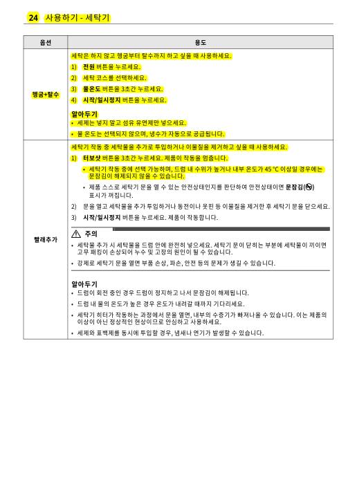

PDF 39쪽 · 형광펜 청크: `p39-c1`

PDF 19쪽 · 형광펜 청크: `p19-c1`

PDF 14쪽 · 형광펜 청크: `p14-c1`

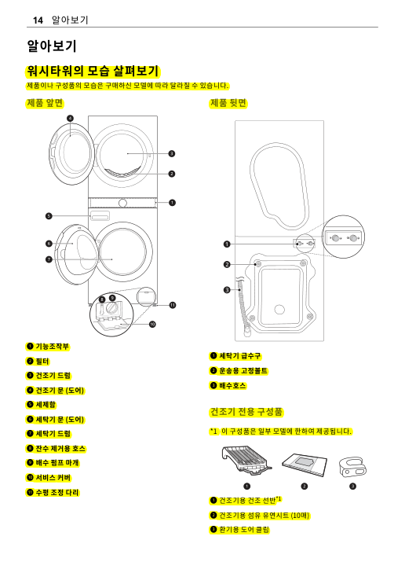

PDF 56쪽 · 형광펜 청크: `p56-c2`

PDF 55쪽 · 형광펜 청크: `p55-c1`

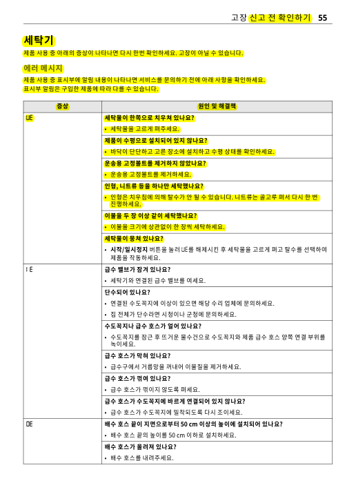

PDF 42쪽 · 형광펜 청크: `p42-c2`

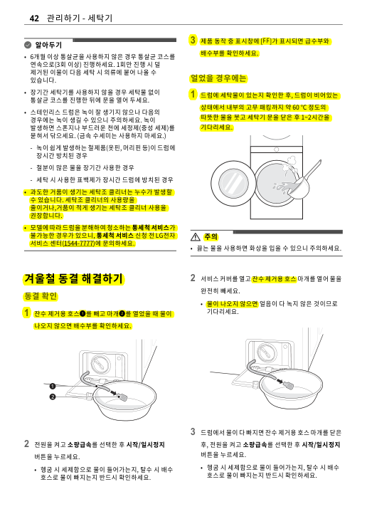

