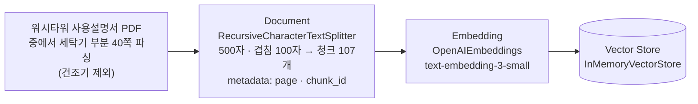
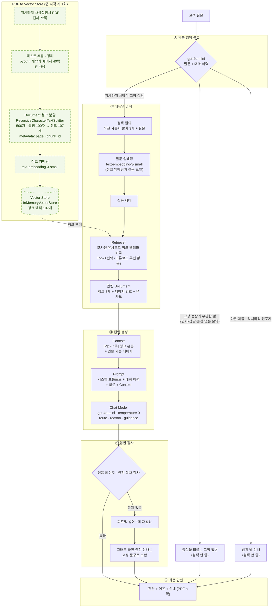
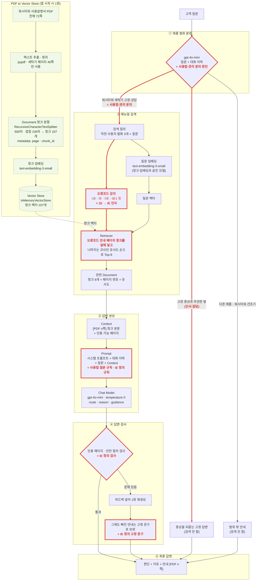

1. 일시 : 2026년 10월 2일 금요일
2. 작성자 : 4기 5반 조해수(P168)
3. 프로젝트명 : **워시타워 세탁기 A/S 상담 도우미**

<br />

상담 앱을 웹에도 배포하였으니 함께보셔도 좋습니다. \
: <https://homeappliance-repair-service-chatagent.onrender.com/>

***

###### Step 1. 문제 및 문서 정의

**제품 사용설명서 PDF를 근거로 ‘워시타워 세탁기 A/S 접수’ 상담하고,**

**고객 증상이 간단한 자가 조치로 해결 가능한 지 or 서비스 기사 점검이 필요한지 판단하는 RAG**

```
고객 질문 → ① 제품 범위 분류 → ② 매뉴얼 PDF 검색 → ③ 답변 생성 → ④ 답변 검사 → ⑤ 최종 답변

```

#### ① 누가 사용하는가

* **고객 (사용자)**: 세탁기 고장이나 작동 이상, 사용법에 대해 궁금증을 가지고 있으나 사용설명서를 직접 읽기 귀찮아하거나 어려워하여 곧바로 서비스 기사 방문을 요청하려는 일반 소비자.

* **상담 에이전트 시스템**: 고객의 자연어 질문 의도를 파악하고, 워시타워 매뉴얼을 기반으로 적절한 자가 점검 방법을 우선 안내하거나 실제 서비스 기사 점검이 필요한 경우를 판별해 주는 AI 어시스턴트.

###### ② 어떤 문서를 검색하는가

* **주요 문서**: LG전자 워시타워 사용설명서 PDF 중 **세탁기 관련 파트 (총 72쪽 중 세탁기 전용 40쪽)** 분량.

  * 출처 : <https://www.lge.co.kr/support/product-manuals>

* **제외 대상**: 건조기, 냉장고, 에어컨 등 타 가전제품 매뉴얼 및 워시타워 건조기 전용 파트는 검색 범위에서 제외하여 상담의 정확도를 높임.

###### ③ 어떤 질문까지 답해야 하는가

* **자가 점검 안내 가능한 문의**: **매뉴얼을 통해 고객 스스로 해결할 수 있는 증상**

  * **예시 :** 제품사용법 및 관리방법(급수구 거름망 청소, 통살균 주기, 쉰내·냄새 방지 요령), 간단한 설치방법(세탁기 진동 및 수평 조절)

* **오류코드 대응 및 복합 문의**: `IE`, `UE`, `dE4` 등 주요 에러코드 발생 시 조치 방법, 그리고 겨울철 급수 호스 동파 녹이기와 거름망 청소가 결합된 복합 증상 질의.

* **제품 사용법 및 관리 문의**: 세탁기 올바른 사용법 및 정기 점검 관련 일반 안내. (단, 인사나 잡담, 범위 외 제품 문의는 안내 문구나 고정 답변으로 처리)

###### ④ 문서에 근거가 없을 때 어떻게 답할 것인가

* **문서에 근거 없음 명확히 밝힌다**: 무상 보증기간, 출장비용 등 매뉴얼 문서 내에 근거가 존재하지 않는 질문에 대해서는 **임의로 수치나 내용을 지어내지 않고**, 고객센터 문의 유도 등 정해진 표준 안내 문구로 대응합니다.

<br />

* 상담 분류 예시 : 상담 체인은 답변 앞에 **판단(분류)** 과 **이유**를 함께 표시합니다.

  | 분류              | 의미                                            | 판단 이유 예시                                                       |
  | :-------------- | :-------------------------------------------- | :------------------------------------------------------------- |
  | 🟢 자가 점검 우선     | 설명서에 고객이 할 수 있는 조치가 있고, 아직 시도하지 않은 경우         | (LE) 세탁물을 한꺼번에 많이 넣었고 아직 양을 줄여보지 않아, 설명서의 세탁물 감량부터 확인할 수 있습니다. |
  | 🟠 서비스 기사 점검 권장 | 조치를 해도 반복되거나, 위험 징후가 있거나, 설명서가 전문 점검을 요구하는 경우 | (dE1) 문을 네 번 다시 닫고 옷 끼임까지 확인했는데도 오류가 계속되어 전문 점검이 필요합니다.        |
  | 🔵 추가 확인 필요     | 판단에 필요한 정보가 실제로 부족한 경우                        | 물이 안 빠진다고만 하셔서, 화면의 오류코드와 배수 호스 상태를 먼저 확인해야 합니다.               |
  | ⚪ 상담 범위 외       | 워시타워 세탁기가 아닌 제품                               | 냉장고 냉동실 문의로, 워시타워 세탁기 설명서로 안내할 수 없습니다.                         |

  <br />

  <br />

***

#### Step 2. Baseline RAG 구현

**\[준비]** : Document → Embedding → Vector Store



**\[준비+실행]\(baseline ver)** : 질문 → Retriever → 관련 Document → Context → Prompt → Chat Model → 답변



**\[준비+실행]\(improved ver)** : 질문 → Retriever → 관련 Document → Context → Prompt → Chat Model → 답변

#### 주요 변경 사항 요약

**① 상담 범위 확장 (제품 사용법·관리방법 문의 포함)**

**② 오류코드 오타 감지 및 우선 검색(Retriever) 로직 도입 (오류코드 오타 보정**`1E`를 `IE`**로 인식하도록)**

**③ 프롬프트 규칙 보강 (제품 사용법 질문처리 규칙 보강, IE 에러 정의 명확화하여 답변 품질 향상)**

**④ 답변 검사(Guardrail) 및 고정 문구 보완 강화**



<br />

<br />

***

#### Step 3. 테스트 질문 구성

정답이 명확한 질문, 표현이 다른 질문, 키워드 중심 질문, 복합 질문, 문서에 없는 질문 등을 포함해 **8\~10개**의 테스트 질문을 구성합니다.

**목적:** 다양한 질문 유형에서 검색과 답변 품질을 확인하고, 동일한 조건으로 전·후 결과를 비교하기 위함입니다.

| 유형          | 예시                                                             | 확인목적              |
| :---------- | :------------------------------------------------------------- | :---------------- |
| 정답이 명확한 질문  | 급수구 거름망은 어떻게 청소하나요?                                            | 기본 검색 성능          |
| 정답이 명확한 질문  | 통살균 코스는 얼마나 자주 해야 하나요?                                         | 기본 검색 성능          |
| 표현이 다른 질문   | 빨래를 다 하고 꺼냈는데 옷에서 쉰내가 나요.                                      | 의미 검색             |
| 표현이 다른 질문   | 탈수할 때 세탁기가 덜덜거리면서 자리에서 조금씩 움직여요.                               | 의미 검색             |
| 키워드가 정확한 질문 | 세탁기 화면에 1E라고 떠요. 어떻게 해야 하나요?(\*1E는 고객이 잘못 말한 표현. IE가 에러코드임)    | 키워드/하이브리드 검색      |
| 키워드가 정확한 질문 | dE4가 떠요.                                                       | 키워드/하이브리드 검색      |
| 복합 질문       | IE가 뜨는데 겨울이라 급수 호스가 얼었을 수도 있어요. 녹이는 방법이랑 거름망 청소 방법을 둘 다 알려주세요. | decomposition 필요성 |
| 복합 질문       | UE가 떠서 이불을 한 장씩 나눠 빨았는데, 이번에는 빨래에서 냄새가 나요. 두 가지 다 어떻게 해야 하나요?  | decomposition 필요성 |
| 문서에 없는 질문   | 세탁기 무상 보증기간이 몇 년인가요?                                           | 근거 없음 처리          |
| 문서에 없는 질문   | 세탁기 수리 기사님 출장비는 얼마인가요?                                         | 근거 없음 처리          |

(참고) 에러코드 사진


<br />

***

## 유첨. 실행 파일 사용 방법

### 파일 구성

| 파일                                     | 역할                                                             |
| :------------------------------------- | :------------------------------------------------------------- |
| `app.py`                               | 상담 앱 챗봇 (PDF 색인 → 범위 분류 → 매뉴얼 검색 → 답변 생성 → 답변 검사 → Gradio 화면)  |
| `eval/run_eval.py`                     | 평가 질문을 한 가지 검색 방식으로 실행하고 결과를 기록 (Step 4 양식 + 근거 캡처)            |
| `eval/compare.py`                      | 두 개 이상의 평가 결과를 비교해 개선 전·후 비교 문서 생성                             |
| `eval/questions.json`                  | 평가 질문 10개와 질문별 정답 페이지                                          |
| `eval/changes/baseline_to_improved.md` | Baseline → Improved 변경 이력 (비교 문서 앞부분에 포함)                      |
| `eval/results/`                        | 평가 결과(`.md`, `.json`), 근거 캡처(`captures/`), 비교 문서               |

<br />

### 1. 준비

```bash
pip install -r requirements.txt
```

프로젝트 폴더의 `.env`에 OpenAI API 키를 넣습니다. 앱과 평가 스크립트 모두 시작할 때 매뉴얼 청크 107개를 임베딩하므로 키가 반드시 필요합니다.

```
OPENAI_API_KEY=sk-...
```

### 2. 상담 앱 실행 (`app.py`)

```bash
python app.py                           # http://127.0.0.1:7860
RETRIEVER_MODE=baseline python app.py   # Baseline 검색 방식으로 실행
```

| 환경변수                           | 설명                                                          | 기본값       |
| :----------------------------- | :---------------------------------------------------------- | :-------- |
| `OPENAI_API_KEY`               | OpenAI API 키 (필수)                                           | -         |
| `RETRIEVER_MODE`               | 검색 방식. `baseline`(순수 벡터 RAG) 또는 `current`(오류코드 키워드 검색 + 벡터) | `current` |
| `PORT`                         | 서버 포트                                                       | `7860`    |
| `APP_USERNAME`, `APP_PASSWORD` | 둘 다 넣으면 로그인 창이 붙음                                           | 없음        |

시작 로그에서 청크 수·metadata 검사 결과와 사용 중인 검색 방식을 확인할 수 있습니다.

### 3. 평가 실행 (`eval/run_eval.py`)

```bash
python eval/run_eval.py --mode baseline                    # 순수 벡터 RAG로 평가
python eval/run_eval.py --mode current --label improved    # 현재 검색 방식으로 평가, 파일 이름은 improved
```

| 옵션                   | 설명                                                               |
| :------------------- | :--------------------------------------------------------------- |
| `--mode`             | 검색 방식 (`app.py`의 `RETRIEVER_MODE`와 같은 이름: `baseline`, `current`) |
| `--label`            | 결과 파일 이름 (기본값: 검색 방식 이름)                                         |
| `--questions`        | 평가 질문 파일 (기본값: `eval/questions.json`)                            |
| `--render <결과.json>` | 다시 실행하지 않고 결과 json으로 `.md`와 근거 캡처만 다시 만듦 (API 호출 없음)             |

실행 결과는 `eval/results/`에 저장됩니다.

* `<날짜_시각>_<label>.json`: 질문별 검색 Top-K(청크 본문 포함), 답변, 지표, 문제점

* `<날짜_시각>_<label>.md`: Step 4 양식 기록 (질문 · 검색 Top-K 문서 · 정답 문서 포함 여부 · 최종 답변 · 문서 근거 여부 · 문제점) + 문항별 근거 캡처

* `captures/<날짜_시각>_<label>/`: 답변이 인용한 페이지와 검색된 페이지의 PDF 캡처 (검색된 청크에 노란 형광펜)

답변을 직접 검토했다면 결과 json의 각 질문에 `"verdict"`(O/△/X)와 `"review"`(문제점 목록)를 적고 `--render`로 `.md`를 다시 만듭니다.

```bash
python eval/run_eval.py --render eval/results/20261002_1203_baseline.json
```

질문 1회 평가마다 범위 분류·답변 생성·답변 검사로 gpt-4o-mini를 호출하므로, 10문항 1회 실행에 몇 센트 정도의 비용이 듭니다. 같은 검색 결과에서도 답변 문장은 실행마다 조금씩 달라질 수 있습니다.

### 4. 개선 전·후 비교 (`eval/compare.py`)

```bash
python eval/compare.py eval/results/20261002_1203_baseline.json eval/results/20261002_1400_improved.json \
    --notes eval/changes/baseline_to_improved.md
```

* 넘긴 순서가 개선 단계 순서입니다 (첫 번째 = Baseline). 결과 파일은 같은 `questions.json`으로 실행한 것이어야 합니다.

* `--notes`로 넘긴 변경 이력을 문서 앞부분에 넣습니다 (생략 가능).

* 결과: `eval/results/compare_<label1>_vs_<label2>.md` (자동 비교 요약, 질문별 검색·지표 비교, 답변 나란히 비교 + 직접 판정할 '검토' 칸)

### 5. Baseline / Improved 결과 재현

두 단계의 코드는 git 태그로 남겨 두었습니다. 측정 당시 코드로 다시 실행하려면 해당 태그로 이동한 뒤 평가를 실행합니다.

```bash
git checkout baseline                      # Baseline 코드
python eval/run_eval.py --mode baseline

git checkout improved                      # Improved 코드
python eval/run_eval.py --mode current --label improved

git checkout main                          # 원래 상태로 돌아오기
```

